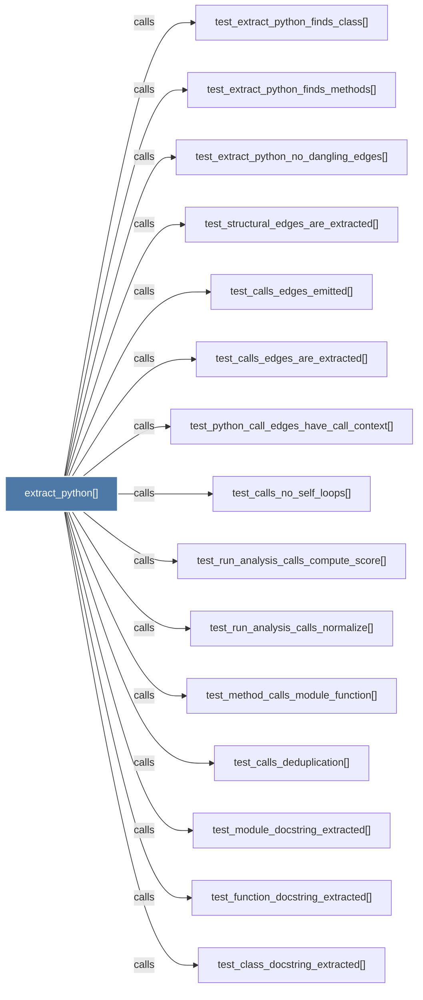

# extract_python()

> [!info] Properties
> **File Type**: code
> **Community**: [[_COMMUNITY_Community None|Community None]]
> **Degree**: 23

## Architecture Graph


## Outbound Connections
- [[Extract classes, functions, and imports from a .py file via tree-sitter AST.]] - `rationale_for` [EXTRACTED]
- [[_extract_generic()]] - `calls` [EXTRACTED]
- [[_extract_python_rationale()]] - `calls` [EXTRACTED]
- [[extract.py]] - `contains` [EXTRACTED]
- [[test_calls_deduplication()]] - `calls` [INFERRED]
- [[test_calls_edges_are_extracted()]] - `calls` [INFERRED]
- [[test_calls_edges_emitted()]] - `calls` [INFERRED]
- [[test_calls_no_self_loops()]] - `calls` [INFERRED]
- [[test_class_docstring_extracted()]] - `calls` [INFERRED]
- [[test_extract_python_finds_class()]] - `calls` [INFERRED]
- [[test_extract_python_finds_methods()]] - `calls` [INFERRED]
- [[test_extract_python_no_dangling_edges()]] - `calls` [INFERRED]
- [[test_function_docstring_extracted()]] - `calls` [INFERRED]
- [[test_method_calls_module_function()]] - `calls` [INFERRED]
- [[test_module_docstring_extracted()]] - `calls` [INFERRED]
- [[test_python_call_edges_have_call_context()]] - `calls` [INFERRED]
- [[test_rationale_comment_extracted()]] - `calls` [INFERRED]
- [[test_rationale_confidence_is_extracted()]] - `calls` [INFERRED]
- [[test_rationale_for_edges_present()]] - `calls` [INFERRED]
- [[test_run_analysis_calls_compute_score()]] - `calls` [INFERRED]
- [[test_run_analysis_calls_normalize()]] - `calls` [INFERRED]
- [[test_short_docstring_ignored()]] - `calls` [INFERRED]
- [[test_structural_edges_are_extracted()]] - `calls` [INFERRED]

## Inbound Dependencies
> [!abstract]- Files that link here
```dataview
LIST
FROM [[extract_python()]]
```

#graphify/code #graphify/INFERRED #community/Community_None