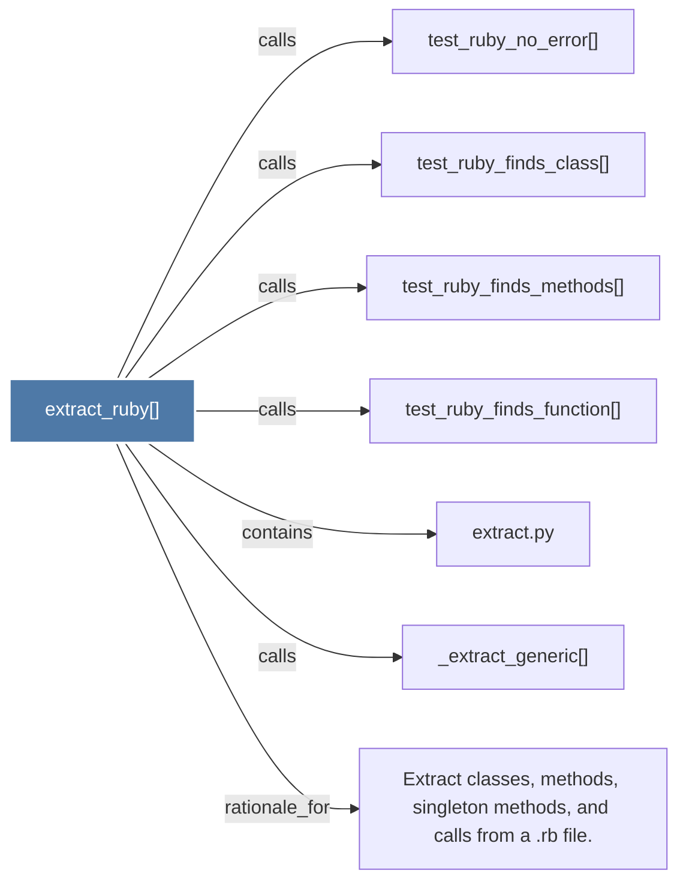

# extract_ruby()

> [!info] Properties
> **File Type**: code
> **Community**: [[_COMMUNITY_Community None|Community None]]
> **Degree**: 7

## Architecture Graph


## Outbound Connections
- [[Extract classes, methods, singleton methods, and calls from a .rb file.]] - `rationale_for` [EXTRACTED]
- [[_extract_generic()]] - `calls` [EXTRACTED]
- [[extract.py]] - `contains` [EXTRACTED]
- [[test_ruby_finds_class()]] - `calls` [INFERRED]
- [[test_ruby_finds_function()]] - `calls` [INFERRED]
- [[test_ruby_finds_methods()]] - `calls` [INFERRED]
- [[test_ruby_no_error()]] - `calls` [INFERRED]

## Inbound Dependencies
> [!abstract]- Files that link here
```dataview
LIST
FROM [[extract_ruby()]]
```

#graphify/code #graphify/INFERRED #community/Community_None