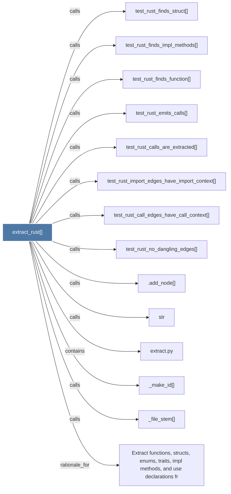

# extract_rust()

> [!info] Properties
> **File Type**: code
> **Community**: [[_COMMUNITY_Community None|Community None]]
> **Degree**: 14

## Architecture Graph


## Outbound Connections
- [[.add_node()]] - `calls` [INFERRED]
- [[Extract functions, structs, enums, traits, impl methods, and use declarations fr]] - `rationale_for` [EXTRACTED]
- [[_file_stem()]] - `calls` [EXTRACTED]
- [[_make_id()]] - `calls` [EXTRACTED]
- [[extract.py]] - `contains` [EXTRACTED]
- [[str]] - `calls` [INFERRED]
- [[test_rust_call_edges_have_call_context()]] - `calls` [INFERRED]
- [[test_rust_calls_are_extracted()]] - `calls` [INFERRED]
- [[test_rust_emits_calls()]] - `calls` [INFERRED]
- [[test_rust_finds_function()]] - `calls` [INFERRED]
- [[test_rust_finds_impl_methods()]] - `calls` [INFERRED]
- [[test_rust_finds_struct()]] - `calls` [INFERRED]
- [[test_rust_import_edges_have_import_context()]] - `calls` [INFERRED]
- [[test_rust_no_dangling_edges()]] - `calls` [INFERRED]

## Inbound Dependencies
> [!abstract]- Files that link here
```dataview
LIST
FROM [[extract_rust()]]
```

#graphify/code #graphify/INFERRED #community/Community_None