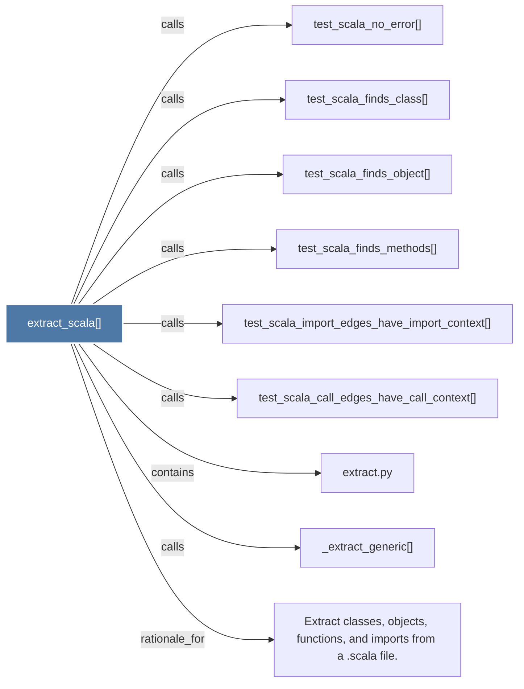

# extract_scala()

> [!info] Properties
> **File Type**: code
> **Community**: [[_COMMUNITY_Community None|Community None]]
> **Degree**: 9

## Architecture Graph


## Outbound Connections
- [[Extract classes, objects, functions, and imports from a .scala file.]] - `rationale_for` [EXTRACTED]
- [[_extract_generic()]] - `calls` [EXTRACTED]
- [[extract.py]] - `contains` [EXTRACTED]
- [[test_scala_call_edges_have_call_context()]] - `calls` [INFERRED]
- [[test_scala_finds_class()]] - `calls` [INFERRED]
- [[test_scala_finds_methods()]] - `calls` [INFERRED]
- [[test_scala_finds_object()]] - `calls` [INFERRED]
- [[test_scala_import_edges_have_import_context()]] - `calls` [INFERRED]
- [[test_scala_no_error()]] - `calls` [INFERRED]

## Inbound Dependencies
> [!abstract]- Files that link here
```dataview
LIST
FROM [[extract_scala()]]
```

#graphify/code #graphify/INFERRED #community/Community_None