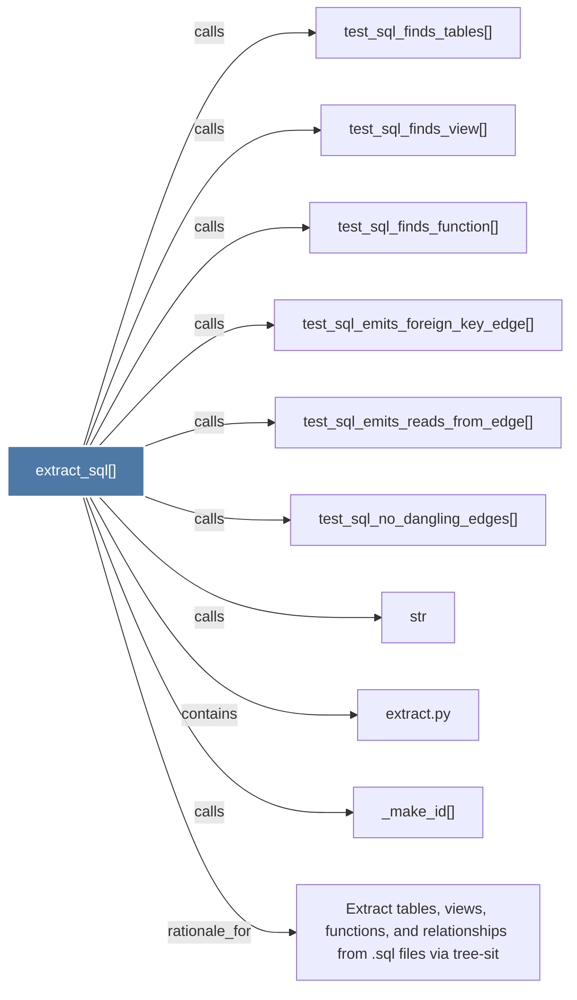

# extract_sql()

> [!info] Properties
> **File Type**: code
> **Community**: [[_COMMUNITY_Community None|Community None]]
> **Degree**: 10

## Architecture Graph


## Outbound Connections
- [[Extract tables, views, functions, and relationships from .sql files via tree-sit]] - `rationale_for` [EXTRACTED]
- [[_make_id()]] - `calls` [EXTRACTED]
- [[extract.py]] - `contains` [EXTRACTED]
- [[str]] - `calls` [INFERRED]
- [[test_sql_emits_foreign_key_edge()]] - `calls` [INFERRED]
- [[test_sql_emits_reads_from_edge()]] - `calls` [INFERRED]
- [[test_sql_finds_function()]] - `calls` [INFERRED]
- [[test_sql_finds_tables()]] - `calls` [INFERRED]
- [[test_sql_finds_view()]] - `calls` [INFERRED]
- [[test_sql_no_dangling_edges()]] - `calls` [INFERRED]

## Inbound Dependencies
> [!abstract]- Files that link here
```dataview
LIST
FROM [[extract_sql()]]
```

#graphify/code #graphify/INFERRED #community/Community_None