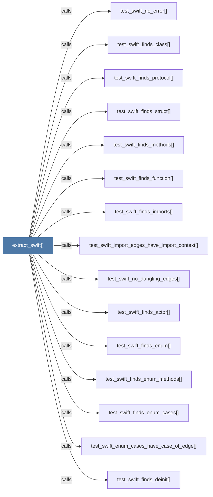

# extract_swift()

> [!info] Properties
> **File Type**: code
> **Community**: [[_COMMUNITY_Community None|Community None]]
> **Degree**: 25

## Architecture Graph


## Outbound Connections
- [[Extract classes, structs, protocols, functions, imports, and calls from a .swift]] - `rationale_for` [EXTRACTED]
- [[_extract_generic()]] - `calls` [EXTRACTED]
- [[extract.py]] - `contains` [EXTRACTED]
- [[test_swift_call_edges_have_call_context()]] - `calls` [INFERRED]
- [[test_swift_conformance_edge()]] - `calls` [INFERRED]
- [[test_swift_emits_calls()]] - `calls` [INFERRED]
- [[test_swift_enum_cases_have_case_of_edge()]] - `calls` [INFERRED]
- [[test_swift_extension_conformance_edge()]] - `calls` [INFERRED]
- [[test_swift_extension_does_not_duplicate_type_node()]] - `calls` [INFERRED]
- [[test_swift_extension_methods_attach_to_type()]] - `calls` [INFERRED]
- [[test_swift_finds_actor()]] - `calls` [INFERRED]
- [[test_swift_finds_class()]] - `calls` [INFERRED]
- [[test_swift_finds_deinit()]] - `calls` [INFERRED]
- [[test_swift_finds_enum()]] - `calls` [INFERRED]
- [[test_swift_finds_enum_cases()]] - `calls` [INFERRED]
- [[test_swift_finds_enum_methods()]] - `calls` [INFERRED]
- [[test_swift_finds_function()]] - `calls` [INFERRED]
- [[test_swift_finds_imports()]] - `calls` [INFERRED]
- [[test_swift_finds_methods()]] - `calls` [INFERRED]
- [[test_swift_finds_protocol()]] - `calls` [INFERRED]
- [[test_swift_finds_struct()]] - `calls` [INFERRED]
- [[test_swift_finds_subscript()]] - `calls` [INFERRED]
- [[test_swift_import_edges_have_import_context()]] - `calls` [INFERRED]
- [[test_swift_no_dangling_edges()]] - `calls` [INFERRED]
- [[test_swift_no_error()]] - `calls` [INFERRED]

## Inbound Dependencies
> [!abstract]- Files that link here
```dataview
LIST
FROM [[extract_swift()]]
```

#graphify/code #graphify/INFERRED #community/Community_None