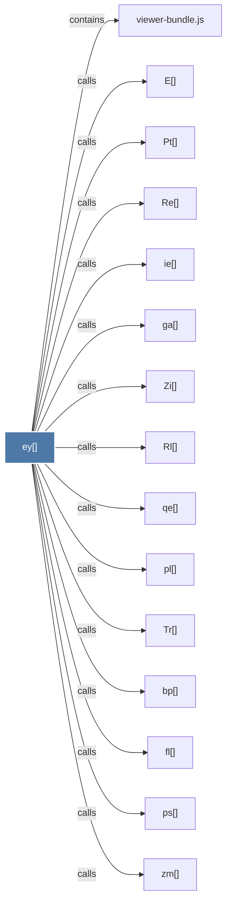

# ey()

> [!info] Properties
> **File Type**: code
> **Community**: [[_COMMUNITY_Community None|Community None]]
> **Degree**: 29

## Architecture Graph


## Outbound Connections
- [[$a()]] - `calls` [EXTRACTED]
- [[An()]] - `calls` [EXTRACTED]
- [[Dr()]] - `calls` [EXTRACTED]
- [[E()]] - `calls` [EXTRACTED]
- [[Es()]] - `calls` [EXTRACTED]
- [[Pt()]] - `calls` [EXTRACTED]
- [[Re()]] - `calls` [EXTRACTED]
- [[Rl()]] - `calls` [EXTRACTED]
- [[Ti()]] - `calls` [EXTRACTED]
- [[Tr()]] - `calls` [EXTRACTED]
- [[Zi()]] - `calls` [EXTRACTED]
- [[Zn()]] - `calls` [EXTRACTED]
- [[ad()]] - `calls` [EXTRACTED]
- [[bp()]] - `calls` [EXTRACTED]
- [[fl()]] - `calls` [EXTRACTED]
- [[ga()]] - `calls` [EXTRACTED]
- [[i0()]] - `calls` [EXTRACTED]
- [[ie()]] - `calls` [EXTRACTED]
- [[pl()]] - `calls` [EXTRACTED]
- [[ps()]] - `calls` [EXTRACTED]
- [[qc()]] - `calls` [EXTRACTED]
- [[qe()]] - `calls` [EXTRACTED]
- [[s0()]] - `calls` [EXTRACTED]
- [[se()]] - `calls` [EXTRACTED]
- [[viewer-bundle.js]] - `contains` [EXTRACTED]
- [[vl()]] - `calls` [EXTRACTED]
- [[xr()]] - `calls` [EXTRACTED]
- [[ys()]] - `calls` [EXTRACTED]
- [[zm()]] - `calls` [EXTRACTED]

## Inbound Dependencies
> [!abstract]- Files that link here
```dataview
LIST
FROM [[ey()]]
```

#graphify/code #graphify/EXTRACTED #community/Community_None