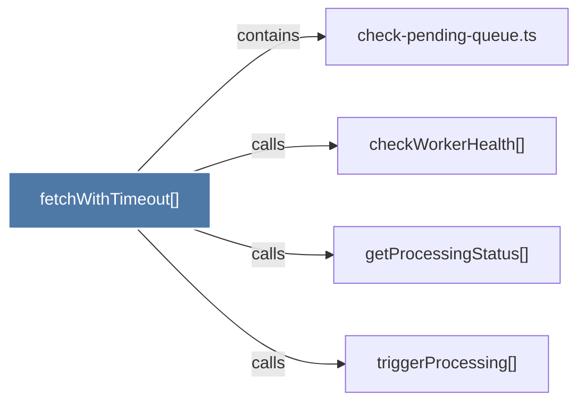

# fetchWithTimeout()

> [!info] Properties
> **File Type**: code
> **Community**: [[_COMMUNITY_Community None|Community None]]
> **Degree**: 4

## Architecture Graph


## Outbound Connections
- [[check-pending-queue.ts]] - `contains` [EXTRACTED]
- [[checkWorkerHealth()]] - `calls` [EXTRACTED]
- [[getProcessingStatus()]] - `calls` [EXTRACTED]
- [[triggerProcessing()]] - `calls` [EXTRACTED]

## Inbound Dependencies
> [!abstract]- Files that link here
```dataview
LIST
FROM [[fetchWithTimeout()_1]]
```

#graphify/code #graphify/EXTRACTED #community/Community_None