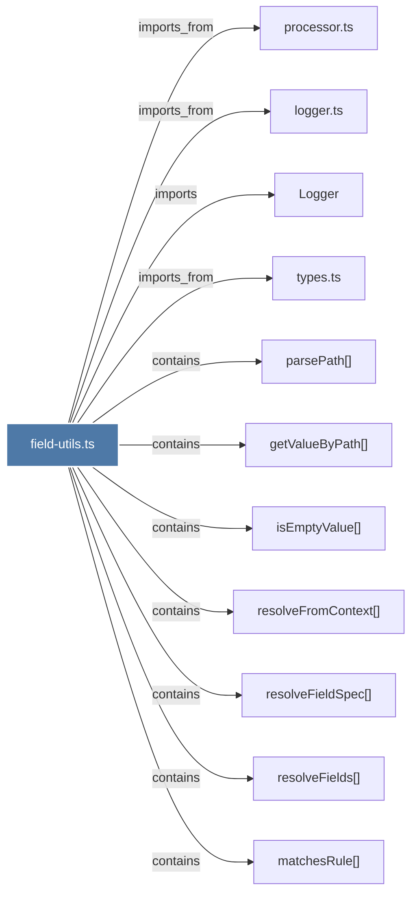

# field-utils.ts

> [!info] Properties
> **File Type**: code
> **Community**: [[_COMMUNITY_Community None|Community None]]
> **Degree**: 11

## Architecture Graph


## Outbound Connections
- [[Logger]] - `imports` [EXTRACTED]
- [[getValueByPath()]] - `contains` [EXTRACTED]
- [[isEmptyValue()]] - `contains` [EXTRACTED]
- [[logger.ts]] - `imports_from` [EXTRACTED]
- [[matchesRule()]] - `contains` [EXTRACTED]
- [[parsePath()]] - `contains` [EXTRACTED]
- [[processor.ts]] - `imports_from` [EXTRACTED]
- [[resolveFieldSpec()]] - `contains` [EXTRACTED]
- [[resolveFields()]] - `contains` [EXTRACTED]
- [[resolveFromContext()]] - `contains` [EXTRACTED]
- [[types.ts_4]] - `imports_from` [EXTRACTED]

## Inbound Dependencies
> [!abstract]- Files that link here
```dataview
LIST
FROM [[field-utils.ts]]
```

#graphify/code #graphify/EXTRACTED #community/Community_None