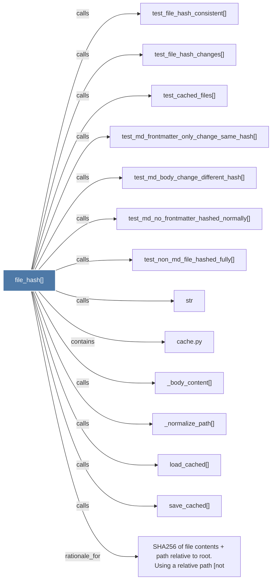

# file_hash()

> [!info] Properties
> **File Type**: code
> **Community**: [[_COMMUNITY_Community None|Community None]]
> **Degree**: 14

## Architecture Graph


## Outbound Connections
- [[SHA256 of file contents + path relative to root.      Using a relative path (not]] - `rationale_for` [EXTRACTED]
- [[_body_content()]] - `calls` [EXTRACTED]
- [[_normalize_path()]] - `calls` [EXTRACTED]
- [[cache.py]] - `contains` [EXTRACTED]
- [[load_cached()]] - `calls` [EXTRACTED]
- [[save_cached()]] - `calls` [EXTRACTED]
- [[str]] - `calls` [INFERRED]
- [[test_cached_files()]] - `calls` [INFERRED]
- [[test_file_hash_changes()]] - `calls` [INFERRED]
- [[test_file_hash_consistent()]] - `calls` [INFERRED]
- [[test_md_body_change_different_hash()]] - `calls` [INFERRED]
- [[test_md_frontmatter_only_change_same_hash()]] - `calls` [INFERRED]
- [[test_md_no_frontmatter_hashed_normally()]] - `calls` [INFERRED]
- [[test_non_md_file_hashed_fully()]] - `calls` [INFERRED]

## Inbound Dependencies
> [!abstract]- Files that link here
```dataview
LIST
FROM [[file_hash()]]
```

#graphify/code #graphify/INFERRED #community/Community_None