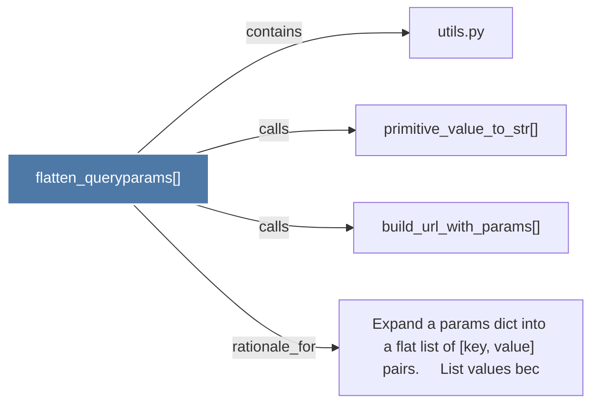

# flatten_queryparams()

> [!info] Properties
> **File Type**: code
> **Community**: [[_COMMUNITY_Community None|Community None]]
> **Degree**: 4

## Architecture Graph


## Outbound Connections
- [[Expand a params dict into a flat list of (key, value) pairs.     List values bec]] - `rationale_for` [EXTRACTED]
- [[build_url_with_params()]] - `calls` [EXTRACTED]
- [[primitive_value_to_str()]] - `calls` [EXTRACTED]
- [[utils.py]] - `contains` [EXTRACTED]

## Inbound Dependencies
> [!abstract]- Files that link here
```dataview
LIST
FROM [[flatten_queryparams()]]
```

#graphify/code #graphify/EXTRACTED #community/Community_None