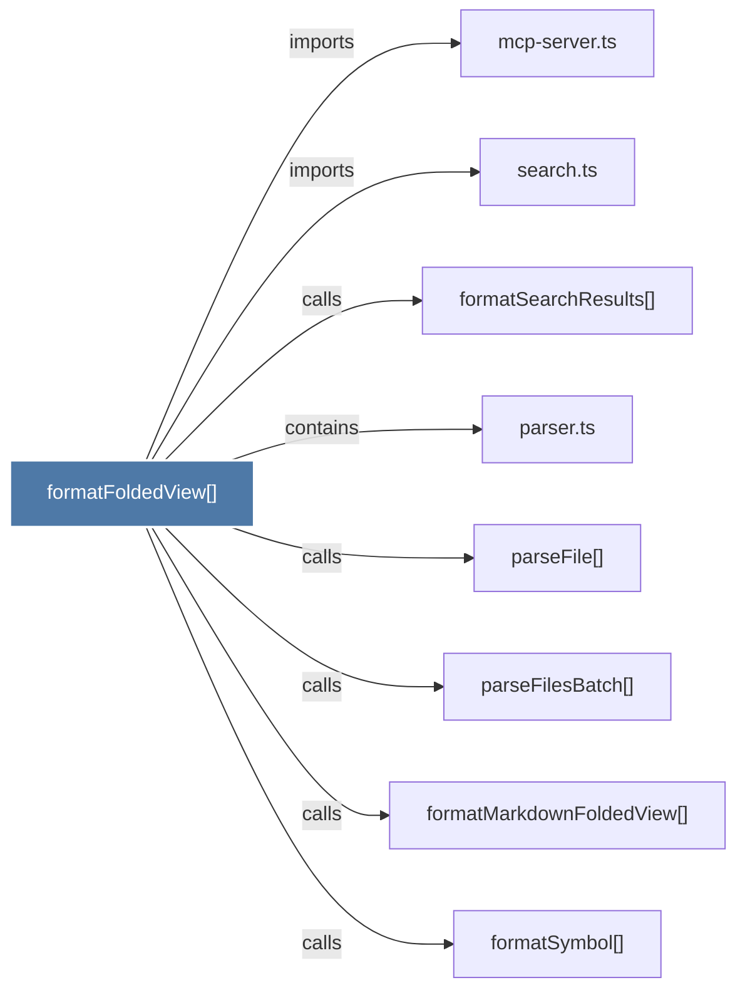

# formatFoldedView()

> [!info] Properties
> **File Type**: code
> **Community**: [[_COMMUNITY_Community None|Community None]]
> **Degree**: 8

## Architecture Graph


## Outbound Connections
- [[formatMarkdownFoldedView()]] - `calls` [EXTRACTED]
- [[formatSearchResults()]] - `calls` [INFERRED]
- [[formatSymbol()]] - `calls` [EXTRACTED]
- [[mcp-server.ts]] - `imports` [EXTRACTED]
- [[parseFile()]] - `calls` [EXTRACTED]
- [[parseFilesBatch()]] - `calls` [EXTRACTED]
- [[parser.ts_1]] - `contains` [EXTRACTED]
- [[search.ts]] - `imports` [EXTRACTED]

## Inbound Dependencies
> [!abstract]- Files that link here
```dataview
LIST
FROM [[formatFoldedView()]]
```

#graphify/code #graphify/EXTRACTED #community/Community_None