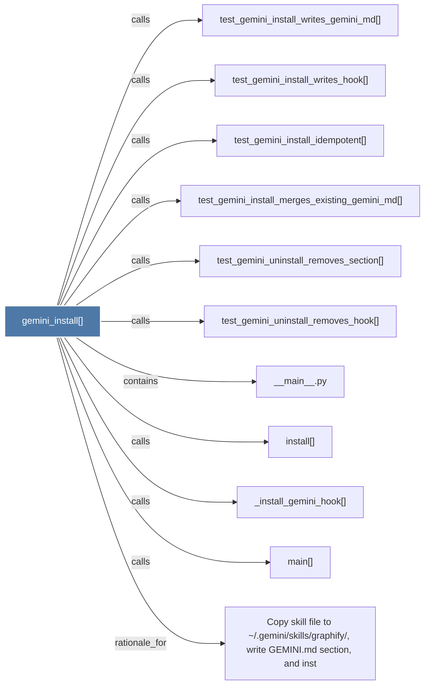

# gemini_install()

> [!info] Properties
> **File Type**: code
> **Community**: [[_COMMUNITY_Community None|Community None]]
> **Degree**: 11

## Architecture Graph


## Outbound Connections
- [[Copy skill file to ~.geminiskillsgraphify, write GEMINI.md section, and inst]] - `rationale_for` [EXTRACTED]
- [[__main__.py]] - `contains` [EXTRACTED]
- [[_install_gemini_hook()]] - `calls` [EXTRACTED]
- [[install()_1]] - `calls` [EXTRACTED]
- [[main()_2]] - `calls` [EXTRACTED]
- [[test_gemini_install_idempotent()]] - `calls` [INFERRED]
- [[test_gemini_install_merges_existing_gemini_md()]] - `calls` [INFERRED]
- [[test_gemini_install_writes_gemini_md()]] - `calls` [INFERRED]
- [[test_gemini_install_writes_hook()]] - `calls` [INFERRED]
- [[test_gemini_uninstall_removes_hook()]] - `calls` [INFERRED]
- [[test_gemini_uninstall_removes_section()]] - `calls` [INFERRED]

## Inbound Dependencies
> [!abstract]- Files that link here
```dataview
LIST
FROM [[gemini_install()]]
```

#graphify/code #graphify/INFERRED #community/Community_None