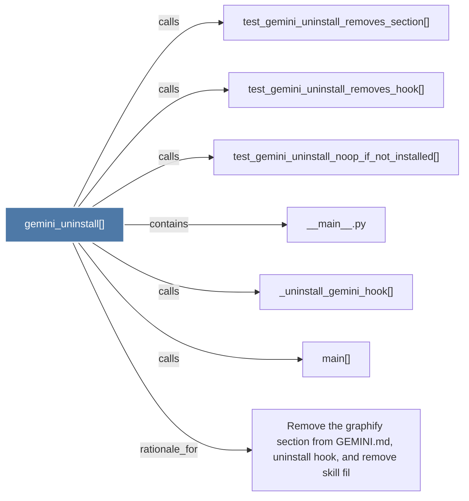

# gemini_uninstall()

> [!info] Properties
> **File Type**: code
> **Community**: [[_COMMUNITY_Community None|Community None]]
> **Degree**: 7

## Architecture Graph


## Outbound Connections
- [[Remove the graphify section from GEMINI.md, uninstall hook, and remove skill fil]] - `rationale_for` [EXTRACTED]
- [[__main__.py]] - `contains` [EXTRACTED]
- [[_uninstall_gemini_hook()]] - `calls` [EXTRACTED]
- [[main()_2]] - `calls` [EXTRACTED]
- [[test_gemini_uninstall_noop_if_not_installed()]] - `calls` [INFERRED]
- [[test_gemini_uninstall_removes_hook()]] - `calls` [INFERRED]
- [[test_gemini_uninstall_removes_section()]] - `calls` [INFERRED]

## Inbound Dependencies
> [!abstract]- Files that link here
```dataview
LIST
FROM [[gemini_uninstall()]]
```

#graphify/code #graphify/EXTRACTED #community/Community_None