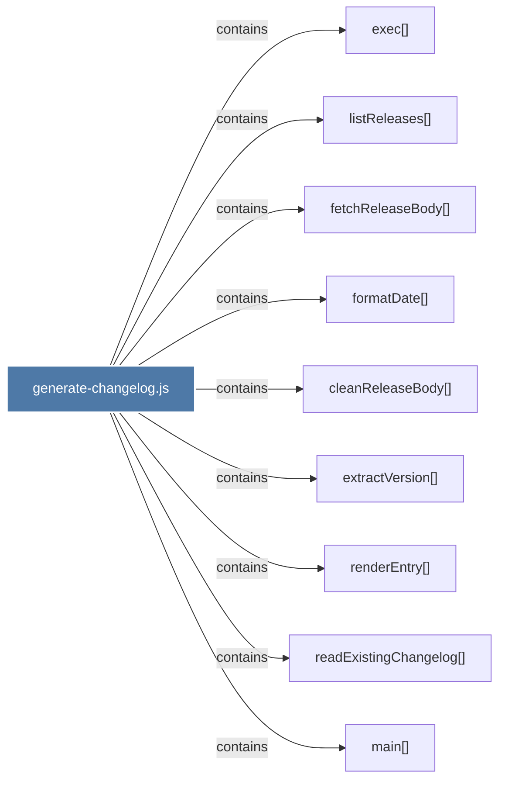

# generate-changelog.js

> [!info] Properties
> **File Type**: code
> **Community**: [[_COMMUNITY_Community None|Community None]]
> **Degree**: 9

## Architecture Graph


## Outbound Connections
- [[cleanReleaseBody()]] - `contains` [EXTRACTED]
- [[exec()]] - `contains` [EXTRACTED]
- [[extractVersion()]] - `contains` [EXTRACTED]
- [[fetchReleaseBody()]] - `contains` [EXTRACTED]
- [[formatDate()_3]] - `contains` [EXTRACTED]
- [[listReleases()]] - `contains` [EXTRACTED]
- [[main()_33]] - `contains` [EXTRACTED]
- [[readExistingChangelog()]] - `contains` [EXTRACTED]
- [[renderEntry()]] - `contains` [EXTRACTED]

## Inbound Dependencies
> [!abstract]- Files that link here
```dataview
LIST
FROM [[generate-changelog.js]]
```

#graphify/code #graphify/EXTRACTED #community/Community_None