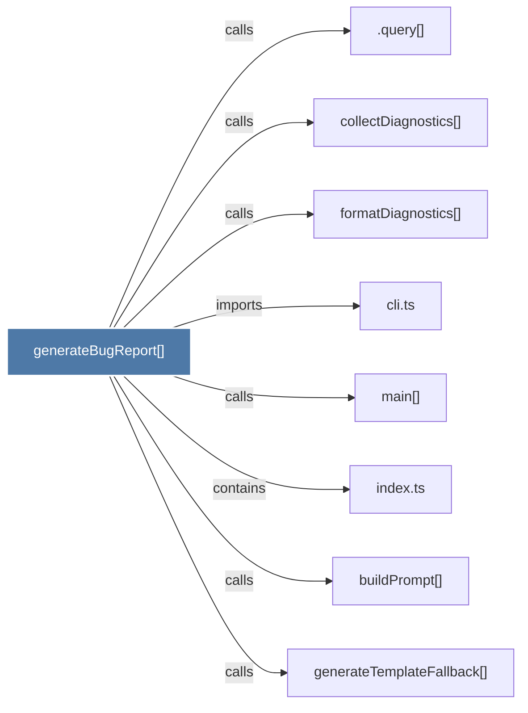

# generateBugReport()

> [!info] Properties
> **File Type**: code
> **Community**: [[_COMMUNITY_Community None|Community None]]
> **Degree**: 8

## Architecture Graph


## Outbound Connections
- [[.query()]] - `calls` [INFERRED]
- [[buildPrompt()]] - `calls` [EXTRACTED]
- [[cli.ts_1]] - `imports` [EXTRACTED]
- [[collectDiagnostics()]] - `calls` [INFERRED]
- [[formatDiagnostics()]] - `calls` [INFERRED]
- [[generateTemplateFallback()]] - `calls` [EXTRACTED]
- [[index.ts_13]] - `contains` [EXTRACTED]
- [[main()_42]] - `calls` [INFERRED]

## Inbound Dependencies
> [!abstract]- Files that link here
```dataview
LIST
FROM [[generateBugReport()]]
```

#graphify/code #graphify/INFERRED #community/Community_None