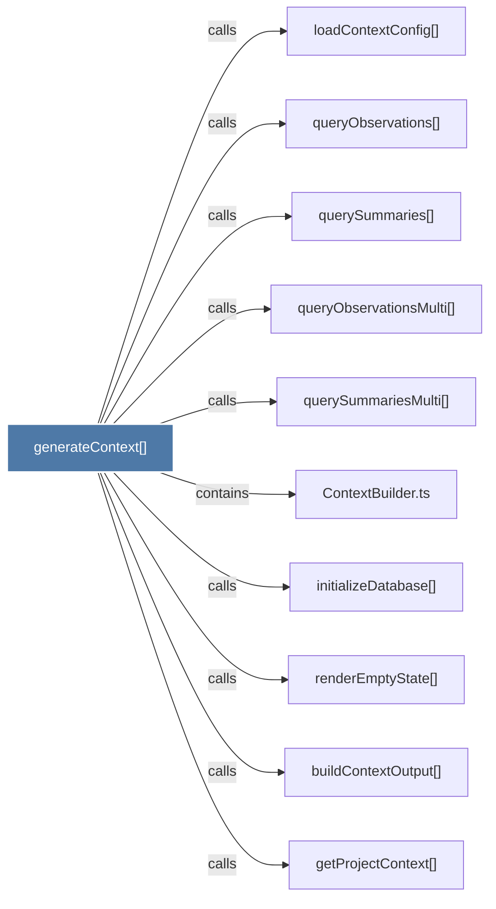

# generateContext()

> [!info] Properties
> **File Type**: code
> **Community**: [[_COMMUNITY_Community None|Community None]]
> **Degree**: 10

## Architecture Graph


## Outbound Connections
- [[ContextBuilder.ts]] - `contains` [EXTRACTED]
- [[buildContextOutput()]] - `calls` [EXTRACTED]
- [[getProjectContext()]] - `calls` [INFERRED]
- [[initializeDatabase()_1]] - `calls` [EXTRACTED]
- [[loadContextConfig()]] - `calls` [INFERRED]
- [[queryObservations()]] - `calls` [INFERRED]
- [[queryObservationsMulti()]] - `calls` [INFERRED]
- [[querySummaries()]] - `calls` [INFERRED]
- [[querySummariesMulti()]] - `calls` [INFERRED]
- [[renderEmptyState()]] - `calls` [EXTRACTED]

## Inbound Dependencies
> [!abstract]- Files that link here
```dataview
LIST
FROM [[generateContext()]]
```

#graphify/code #graphify/INFERRED #community/Community_None