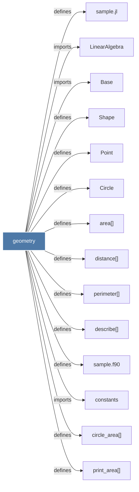

# geometry

> [!info] Properties
> **File Type**: code
> **Community**: [[_COMMUNITY_Community None|Community None]]
> **Degree**: 14

## Architecture Graph


## Outbound Connections
- [[Base]] - `imports` [EXTRACTED]
- [[Circle]] - `defines` [EXTRACTED]
- [[LinearAlgebra]] - `imports` [EXTRACTED]
- [[Point]] - `defines` [EXTRACTED]
- [[Shape]] - `defines` [EXTRACTED]
- [[area()]] - `defines` [EXTRACTED]
- [[circle_area()]] - `defines` [EXTRACTED]
- [[constants]] - `imports` [EXTRACTED]
- [[describe()]] - `defines` [EXTRACTED]
- [[distance()]] - `defines` [EXTRACTED]
- [[perimeter()]] - `defines` [EXTRACTED]
- [[print_area()]] - `defines` [EXTRACTED]
- [[sample.f90]] - `defines` [EXTRACTED]
- [[sample.jl]] - `defines` [EXTRACTED]

## Inbound Dependencies
> [!abstract]- Files that link here
```dataview
LIST
FROM [[geometry]]
```

#graphify/code #graphify/EXTRACTED #community/Community_None