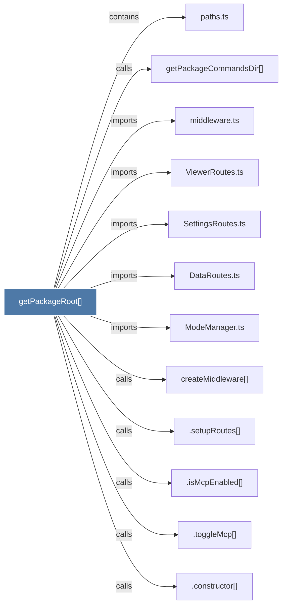

# getPackageRoot()

> [!info] Properties
> **File Type**: code
> **Community**: [[_COMMUNITY_Community None|Community None]]
> **Degree**: 12

## Architecture Graph


## Outbound Connections
- [[.constructor()_34]] - `calls` [INFERRED]
- [[.isMcpEnabled()]] - `calls` [INFERRED]
- [[.setupRoutes()_2]] - `calls` [INFERRED]
- [[.toggleMcp()]] - `calls` [INFERRED]
- [[DataRoutes.ts]] - `imports` [EXTRACTED]
- [[ModeManager.ts]] - `imports` [EXTRACTED]
- [[SettingsRoutes.ts]] - `imports` [EXTRACTED]
- [[ViewerRoutes.ts]] - `imports` [EXTRACTED]
- [[createMiddleware()]] - `calls` [INFERRED]
- [[getPackageCommandsDir()]] - `calls` [EXTRACTED]
- [[middleware.ts]] - `imports` [EXTRACTED]
- [[paths.ts]] - `contains` [EXTRACTED]

## Inbound Dependencies
> [!abstract]- Files that link here
```dataview
LIST
FROM [[getPackageRoot()]]
```

#graphify/code #graphify/EXTRACTED #community/Community_None