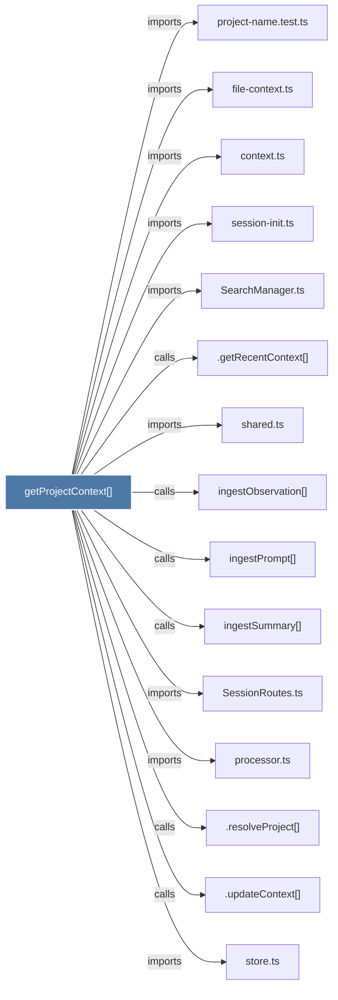

# getProjectContext()

> [!info] Properties
> **File Type**: code
> **Community**: [[_COMMUNITY_Community None|Community None]]
> **Degree**: 24

## Architecture Graph


## Outbound Connections
- [[.getRecentContext()]] - `calls` [INFERRED]
- [[.resolveProject()]] - `calls` [INFERRED]
- [[.updateContext()]] - `calls` [INFERRED]
- [[ContextBuilder.ts]] - `imports` [EXTRACTED]
- [[SearchManager.ts]] - `imports` [EXTRACTED]
- [[SessionRoutes.ts]] - `imports` [EXTRACTED]
- [[WorktreeAdoption.ts]] - `imports` [EXTRACTED]
- [[adoptMergedWorktrees()]] - `calls` [INFERRED]
- [[context.ts]] - `imports` [EXTRACTED]
- [[detectWorktree()]] - `calls` [INFERRED]
- [[expandTilde()]] - `calls` [EXTRACTED]
- [[file-context.ts]] - `imports` [EXTRACTED]
- [[generateContext()]] - `calls` [INFERRED]
- [[getProjectName()]] - `calls` [EXTRACTED]
- [[ingestObservation()]] - `calls` [INFERRED]
- [[ingestPrompt()]] - `calls` [INFERRED]
- [[ingestSummary()]] - `calls` [INFERRED]
- [[processor.ts]] - `imports` [EXTRACTED]
- [[project-name.test.ts]] - `imports` [EXTRACTED]
- [[project-name.ts]] - `contains` [EXTRACTED]
- [[session-init.ts]] - `imports` [EXTRACTED]
- [[shared.ts]] - `imports` [EXTRACTED]
- [[store.ts]] - `imports` [EXTRACTED]
- [[storeObservation()]] - `calls` [INFERRED]

## Inbound Dependencies
> [!abstract]- Files that link here
```dataview
LIST
FROM [[getProjectContext()]]
```

#graphify/code #graphify/EXTRACTED #community/Community_None