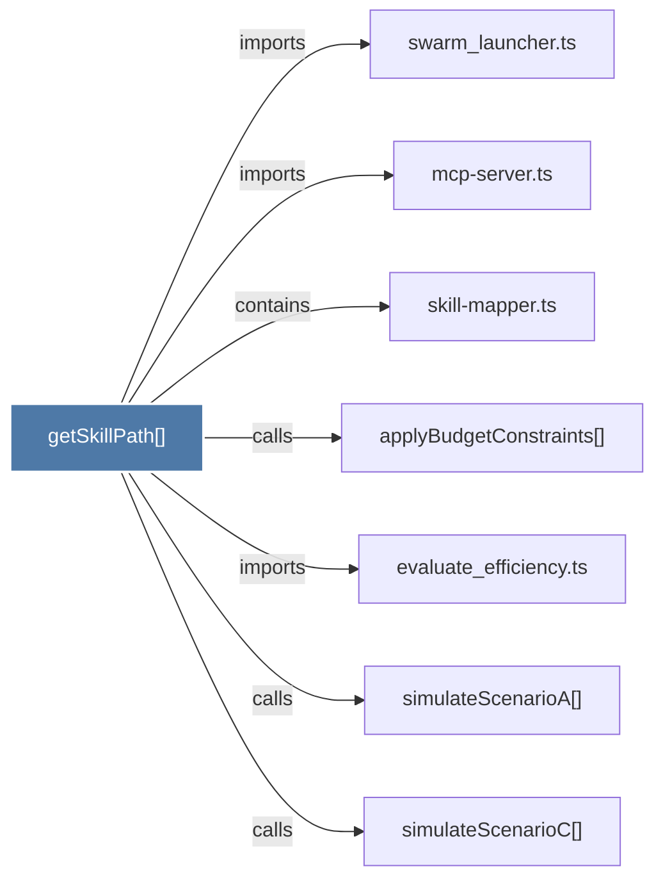

# getSkillPath()

> [!info] Properties
> **File Type**: code
> **Community**: [[_COMMUNITY_Community None|Community None]]
> **Degree**: 7

## Architecture Graph


## Outbound Connections
- [[applyBudgetConstraints()]] - `calls` [EXTRACTED]
- [[evaluate_efficiency.ts]] - `imports` [EXTRACTED]
- [[mcp-server.ts_1]] - `imports` [EXTRACTED]
- [[simulateScenarioA()]] - `calls` [INFERRED]
- [[simulateScenarioC()]] - `calls` [INFERRED]
- [[skill-mapper.ts]] - `contains` [EXTRACTED]
- [[swarm_launcher.ts]] - `imports` [EXTRACTED]

## Inbound Dependencies
> [!abstract]- Files that link here
```dataview
LIST
FROM [[getSkillPath()]]
```

#graphify/code #graphify/EXTRACTED #community/Community_None