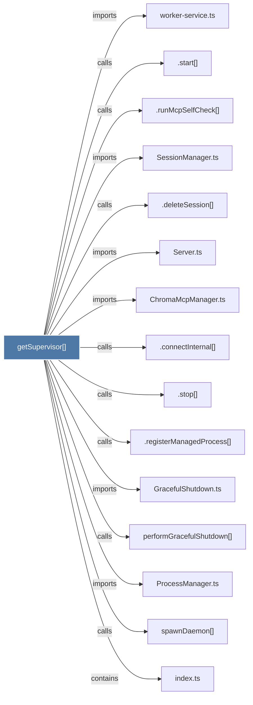

# getSupervisor()

> [!info] Properties
> **File Type**: code
> **Community**: [[_COMMUNITY_Community None|Community None]]
> **Degree**: 15

## Architecture Graph


## Outbound Connections
- [[.connectInternal()]] - `calls` [INFERRED]
- [[.deleteSession()]] - `calls` [INFERRED]
- [[.registerManagedProcess()]] - `calls` [INFERRED]
- [[.runMcpSelfCheck()]] - `calls` [INFERRED]
- [[.start()]] - `calls` [INFERRED]
- [[.stop()_1]] - `calls` [INFERRED]
- [[ChromaMcpManager.ts]] - `imports` [EXTRACTED]
- [[GracefulShutdown.ts]] - `imports` [EXTRACTED]
- [[ProcessManager.ts]] - `imports` [EXTRACTED]
- [[Server.ts]] - `imports` [EXTRACTED]
- [[SessionManager.ts]] - `imports` [EXTRACTED]
- [[index.ts_11]] - `contains` [EXTRACTED]
- [[performGracefulShutdown()]] - `calls` [INFERRED]
- [[spawnDaemon()]] - `calls` [INFERRED]
- [[worker-service.ts]] - `imports` [EXTRACTED]

## Inbound Dependencies
> [!abstract]- Files that link here
```dataview
LIST
FROM [[getSupervisor()]]
```

#graphify/code #graphify/INFERRED #community/Community_None