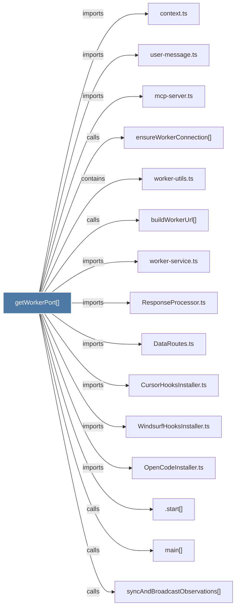

# getWorkerPort()

> [!info] Properties
> **File Type**: code
> **Community**: [[_COMMUNITY_Community None|Community None]]
> **Degree**: 18

## Architecture Graph


## Outbound Connections
- [[.start()]] - `calls` [INFERRED]
- [[CursorHooksInstaller.ts]] - `imports` [EXTRACTED]
- [[DataRoutes.ts]] - `imports` [EXTRACTED]
- [[OpenCodeInstaller.ts]] - `imports` [EXTRACTED]
- [[ResponseProcessor.ts]] - `imports` [EXTRACTED]
- [[WindsurfHooksInstaller.ts]] - `imports` [EXTRACTED]
- [[buildWorkerUrl()]] - `calls` [EXTRACTED]
- [[context.ts]] - `imports` [EXTRACTED]
- [[ensureWorkerConnection()]] - `calls` [INFERRED]
- [[fetchRealContextFromWorker()]] - `calls` [INFERRED]
- [[main()_22]] - `calls` [INFERRED]
- [[mcp-server.ts]] - `imports` [EXTRACTED]
- [[setupWindsurfProjectContext()]] - `calls` [INFERRED]
- [[syncAndBroadcastObservations()]] - `calls` [INFERRED]
- [[syncAndBroadcastSummary()]] - `calls` [INFERRED]
- [[user-message.ts]] - `imports` [EXTRACTED]
- [[worker-service.ts]] - `imports` [EXTRACTED]
- [[worker-utils.ts]] - `contains` [EXTRACTED]

## Inbound Dependencies
> [!abstract]- Files that link here
```dataview
LIST
FROM [[getWorkerPort()]]
```

#graphify/code #graphify/EXTRACTED #community/Community_None