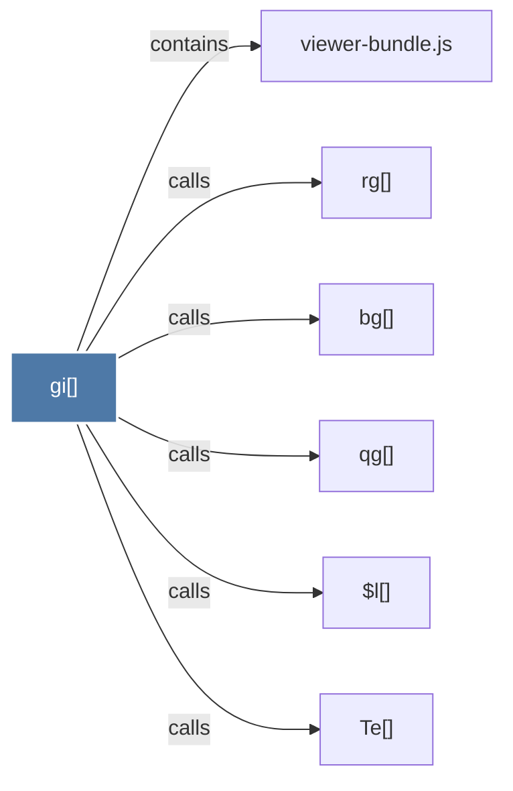

# gi()

> [!info] Properties
> **File Type**: code
> **Community**: [[_COMMUNITY_Community None|Community None]]
> **Degree**: 6

## Architecture Graph


## Outbound Connections
- [[$l()]] - `calls` [EXTRACTED]
- [[Te()]] - `calls` [EXTRACTED]
- [[bg()]] - `calls` [EXTRACTED]
- [[qg()]] - `calls` [EXTRACTED]
- [[rg()]] - `calls` [EXTRACTED]
- [[viewer-bundle.js]] - `contains` [EXTRACTED]

## Inbound Dependencies
> [!abstract]- Files that link here
```dataview
LIST
FROM [[gi()]]
```

#graphify/code #graphify/EXTRACTED #community/Community_None