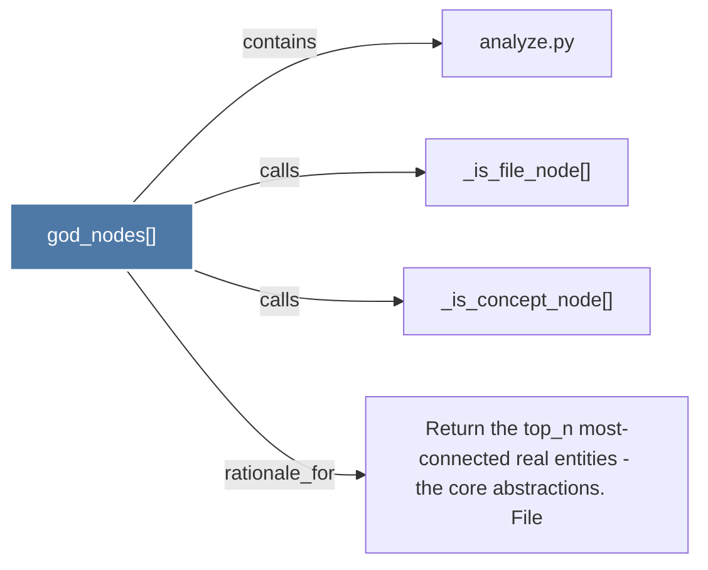

# god_nodes()

> [!info] Properties
> **File Type**: code
> **Community**: [[_COMMUNITY_Community None|Community None]]
> **Degree**: 4

## Architecture Graph


## Outbound Connections
- [[Return the top_n most-connected real entities - the core abstractions.      File]] - `rationale_for` [EXTRACTED]
- [[_is_concept_node()]] - `calls` [EXTRACTED]
- [[_is_file_node()]] - `calls` [EXTRACTED]
- [[analyze.py]] - `contains` [EXTRACTED]

## Inbound Dependencies
> [!abstract]- Files that link here
```dataview
LIST
FROM [[god_nodes()]]
```

#graphify/code #graphify/EXTRACTED #community/Community_None