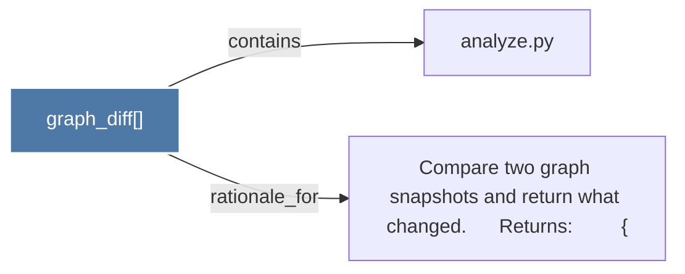

# graph_diff()

> [!info] Properties
> **File Type**: code
> **Community**: [[_COMMUNITY_Community None|Community None]]
> **Degree**: 2

## Architecture Graph


## Outbound Connections
- [[Compare two graph snapshots and return what changed.      Returns         {_1]] - `rationale_for` [EXTRACTED]
- [[analyze.py_1]] - `contains` [EXTRACTED]

## Inbound Dependencies
> [!abstract]- Files that link here
```dataview
LIST
FROM [[graph_diff()_1]]
```

#graphify/code #graphify/EXTRACTED #community/Community_None