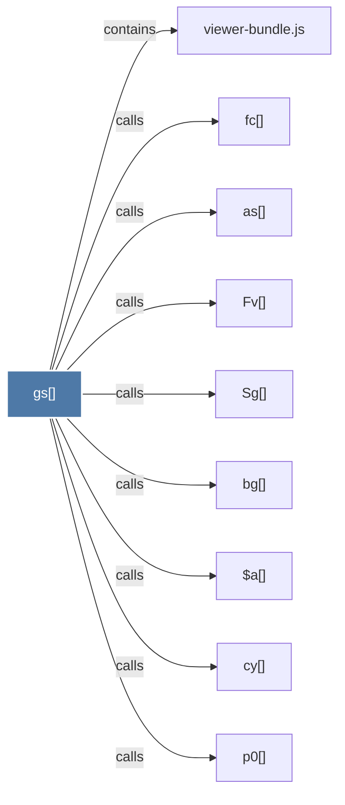

# gs()

> [!info] Properties
> **File Type**: code
> **Community**: [[_COMMUNITY_Community None|Community None]]
> **Degree**: 9

## Architecture Graph


## Outbound Connections
- [[$a()]] - `calls` [EXTRACTED]
- [[Fv()]] - `calls` [EXTRACTED]
- [[Sg()]] - `calls` [EXTRACTED]
- [[as()]] - `calls` [EXTRACTED]
- [[bg()]] - `calls` [EXTRACTED]
- [[cy()]] - `calls` [EXTRACTED]
- [[fc()]] - `calls` [EXTRACTED]
- [[p0()]] - `calls` [EXTRACTED]
- [[viewer-bundle.js]] - `contains` [EXTRACTED]

## Inbound Dependencies
> [!abstract]- Files that link here
```dataview
LIST
FROM [[gs()]]
```

#graphify/code #graphify/EXTRACTED #community/Community_None