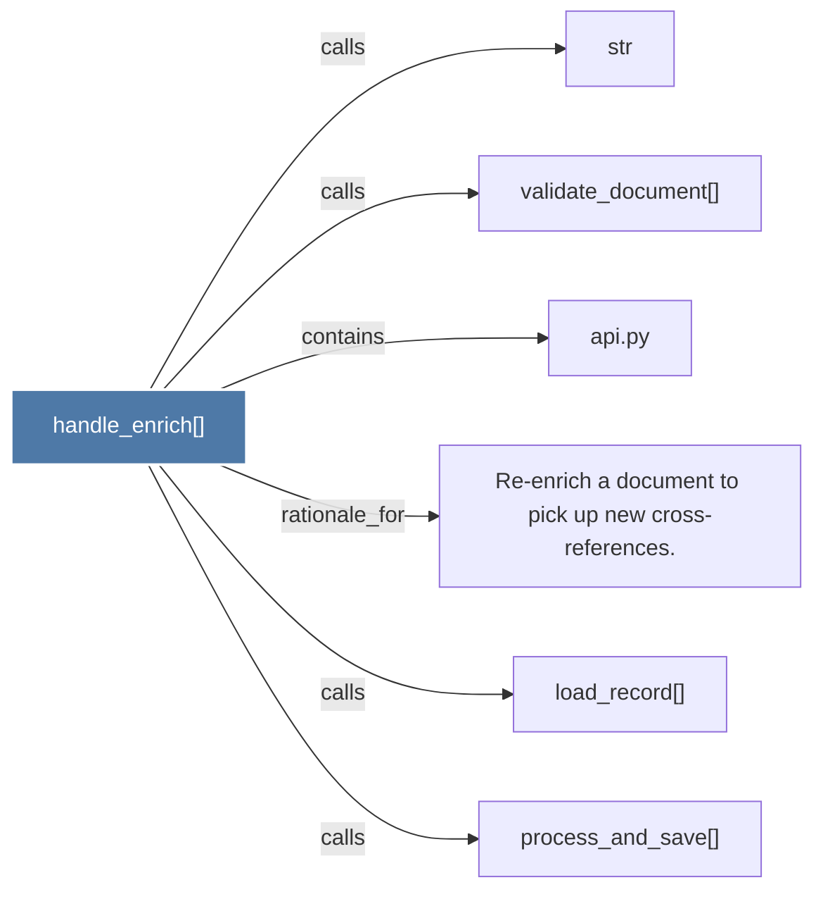

# handle_enrich()

> [!info] Properties
> **File Type**: code
> **Community**: [[_COMMUNITY_Community None|Community None]]
> **Degree**: 6

## Architecture Graph


## Outbound Connections
- [[Re-enrich a document to pick up new cross-references.]] - `rationale_for` [EXTRACTED]
- [[api.py]] - `contains` [EXTRACTED]
- [[load_record()]] - `calls` [INFERRED]
- [[process_and_save()]] - `calls` [INFERRED]
- [[str]] - `calls` [INFERRED]
- [[validate_document()]] - `calls` [INFERRED]

## Inbound Dependencies
> [!abstract]- Files that link here
```dataview
LIST
FROM [[handle_enrich()]]
```

#graphify/code #graphify/INFERRED #community/Community_None