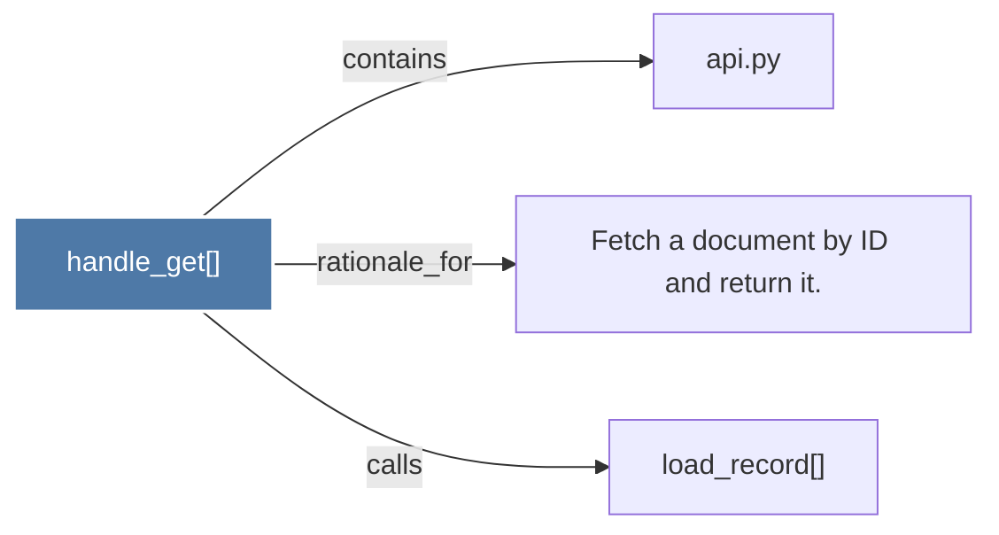

# handle_get()

> [!info] Properties
> **File Type**: code
> **Community**: [[_COMMUNITY_Community None|Community None]]
> **Degree**: 3

## Architecture Graph


## Outbound Connections
- [[Fetch a document by ID and return it.]] - `rationale_for` [EXTRACTED]
- [[api.py]] - `contains` [EXTRACTED]
- [[load_record()]] - `calls` [INFERRED]

## Inbound Dependencies
> [!abstract]- Files that link here
```dataview
LIST
FROM [[handle_get()]]
```

#graphify/code #graphify/EXTRACTED #community/Community_None