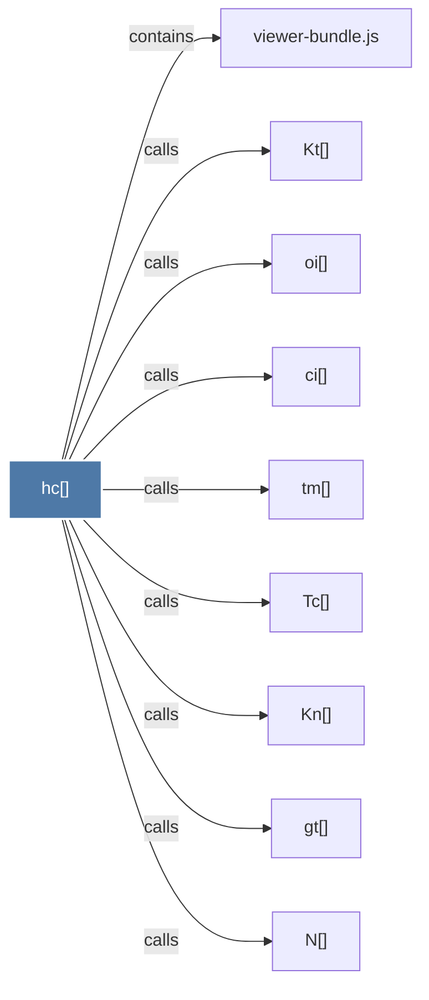

# hc()

> [!info] Properties
> **File Type**: code
> **Community**: [[_COMMUNITY_Community None|Community None]]
> **Degree**: 9

## Architecture Graph


## Outbound Connections
- [[Kn()]] - `calls` [EXTRACTED]
- [[Kt()]] - `calls` [EXTRACTED]
- [[N()]] - `calls` [INFERRED]
- [[Tc()]] - `calls` [EXTRACTED]
- [[ci()]] - `calls` [EXTRACTED]
- [[gt()]] - `calls` [EXTRACTED]
- [[oi()]] - `calls` [EXTRACTED]
- [[tm()]] - `calls` [EXTRACTED]
- [[viewer-bundle.js]] - `contains` [EXTRACTED]

## Inbound Dependencies
> [!abstract]- Files that link here
```dataview
LIST
FROM [[hc()]]
```

#graphify/code #graphify/EXTRACTED #community/Community_None