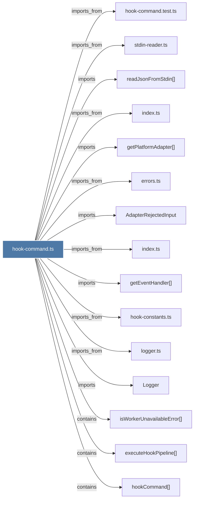

# hook-command.ts

> [!info] Properties
> **File Type**: code
> **Community**: [[_COMMUNITY_Community None|Community None]]
> **Degree**: 16

## Architecture Graph


## Outbound Connections
- [[AdapterRejectedInput]] - `imports` [EXTRACTED]
- [[Logger]] - `imports` [EXTRACTED]
- [[errors.ts]] - `imports_from` [EXTRACTED]
- [[executeHookPipeline()]] - `contains` [EXTRACTED]
- [[getEventHandler()]] - `imports` [EXTRACTED]
- [[getPlatformAdapter()]] - `imports` [EXTRACTED]
- [[hook-command.test.ts]] - `imports_from` [EXTRACTED]
- [[hook-constants.ts]] - `imports_from` [EXTRACTED]
- [[hookCommand()]] - `contains` [EXTRACTED]
- [[index.ts_1]] - `imports_from` [EXTRACTED]
- [[index.ts_2]] - `imports_from` [EXTRACTED]
- [[isWorkerUnavailableError()]] - `contains` [EXTRACTED]
- [[logger.ts]] - `imports_from` [EXTRACTED]
- [[main()_22]] - `imports_from` [EXTRACTED]
- [[readJsonFromStdin()]] - `imports` [EXTRACTED]
- [[stdin-reader.ts]] - `imports_from` [EXTRACTED]

## Inbound Dependencies
> [!abstract]- Files that link here
```dataview
LIST
FROM [[hook-command.ts]]
```

#graphify/code #graphify/EXTRACTED #community/Community_None