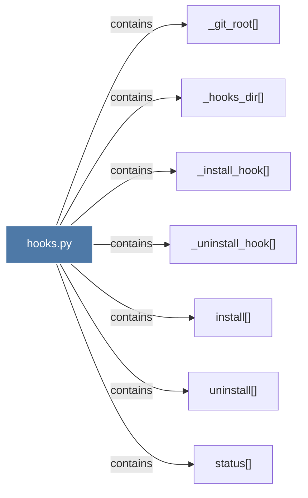

# hooks.py

> [!info] Properties
> **File Type**: code
> **Community**: [[_COMMUNITY_Community None|Community None]]
> **Degree**: 7

## Architecture Graph


## Outbound Connections
- [[_git_root()]] - `contains` [EXTRACTED]
- [[_hooks_dir()]] - `contains` [EXTRACTED]
- [[_install_hook()]] - `contains` [EXTRACTED]
- [[_uninstall_hook()]] - `contains` [EXTRACTED]
- [[install()]] - `contains` [EXTRACTED]
- [[status()]] - `contains` [EXTRACTED]
- [[uninstall()]] - `contains` [EXTRACTED]

## Inbound Dependencies
> [!abstract]- Files that link here
```dataview
LIST
FROM [[hooks.py]]
```

#graphify/code #graphify/EXTRACTED #community/Community_None