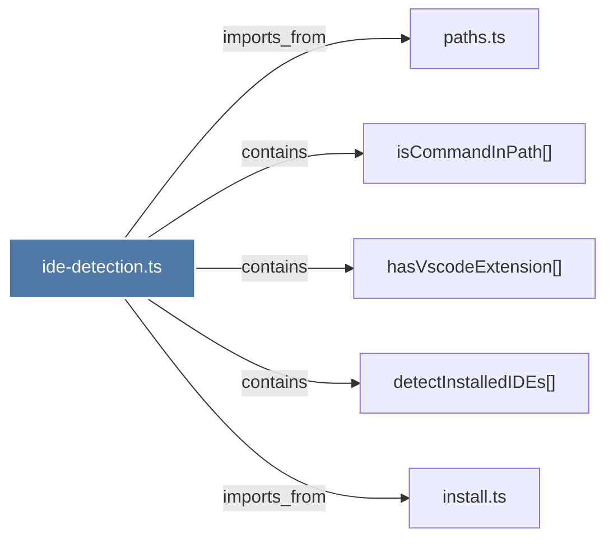

# ide-detection.ts

> [!info] Properties
> **File Type**: code
> **Community**: [[_COMMUNITY_Community None|Community None]]
> **Degree**: 5

## Architecture Graph


## Outbound Connections
- [[detectInstalledIDEs()]] - `contains` [EXTRACTED]
- [[hasVscodeExtension()]] - `contains` [EXTRACTED]
- [[install.ts]] - `imports_from` [EXTRACTED]
- [[isCommandInPath()]] - `contains` [EXTRACTED]
- [[paths.ts_1]] - `imports_from` [EXTRACTED]

## Inbound Dependencies
> [!abstract]- Files that link here
```dataview
LIST
FROM [[ide-detection.ts]]
```

#graphify/code #graphify/EXTRACTED #community/Community_None