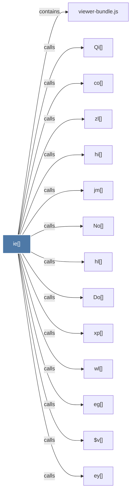

# ie()

> [!info] Properties
> **File Type**: code
> **Community**: [[_COMMUNITY_Community None|Community None]]
> **Degree**: 14

## Architecture Graph


## Outbound Connections
- [[$v()]] - `calls` [EXTRACTED]
- [[Do()]] - `calls` [EXTRACTED]
- [[No()]] - `calls` [EXTRACTED]
- [[Qi()]] - `calls` [EXTRACTED]
- [[co()]] - `calls` [EXTRACTED]
- [[eg()]] - `calls` [EXTRACTED]
- [[ey()]] - `calls` [EXTRACTED]
- [[hi()]] - `calls` [EXTRACTED]
- [[hl()]] - `calls` [EXTRACTED]
- [[jm()]] - `calls` [EXTRACTED]
- [[viewer-bundle.js]] - `contains` [EXTRACTED]
- [[wl()]] - `calls` [EXTRACTED]
- [[xp()]] - `calls` [EXTRACTED]
- [[zl()]] - `calls` [EXTRACTED]

## Inbound Dependencies
> [!abstract]- Files that link here
```dataview
LIST
FROM [[ie()]]
```

#graphify/code #graphify/EXTRACTED #community/Community_None