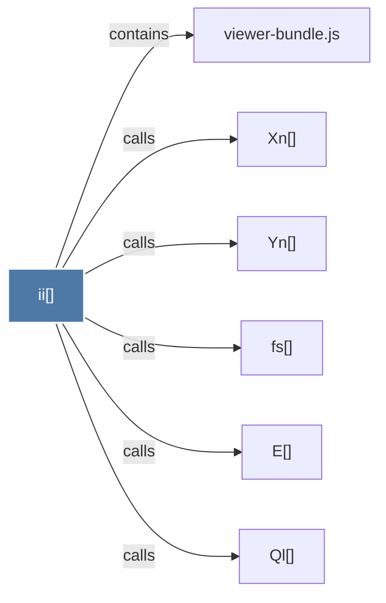

# ii()

> [!info] Properties
> **File Type**: code
> **Community**: [[_COMMUNITY_Community None|Community None]]
> **Degree**: 6

## Architecture Graph


## Outbound Connections
- [[E()]] - `calls` [EXTRACTED]
- [[Ql()]] - `calls` [EXTRACTED]
- [[Xn()]] - `calls` [EXTRACTED]
- [[Yn()]] - `calls` [EXTRACTED]
- [[fs()]] - `calls` [EXTRACTED]
- [[viewer-bundle.js]] - `contains` [EXTRACTED]

## Inbound Dependencies
> [!abstract]- Files that link here
```dataview
LIST
FROM [[ii()]]
```

#graphify/code #graphify/EXTRACTED #community/Community_None