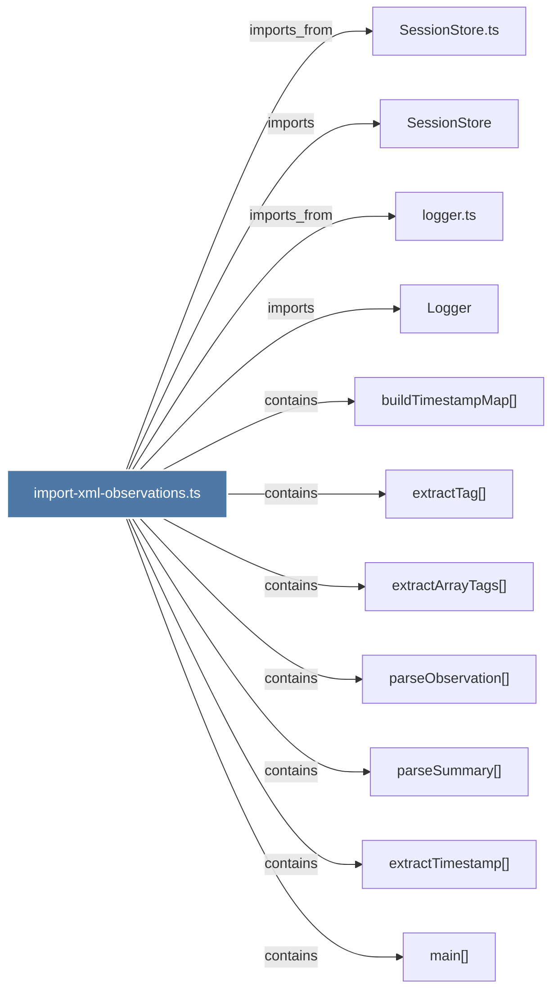

# import-xml-observations.ts

> [!info] Properties
> **File Type**: code
> **Community**: [[_COMMUNITY_Community None|Community None]]
> **Degree**: 11

## Architecture Graph


## Outbound Connections
- [[Logger]] - `imports` [EXTRACTED]
- [[SessionStore]] - `imports` [EXTRACTED]
- [[SessionStore.ts]] - `imports_from` [EXTRACTED]
- [[buildTimestampMap()]] - `contains` [EXTRACTED]
- [[extractArrayTags()]] - `contains` [EXTRACTED]
- [[extractTag()]] - `contains` [EXTRACTED]
- [[extractTimestamp()]] - `contains` [EXTRACTED]
- [[logger.ts]] - `imports_from` [EXTRACTED]
- [[main()_24]] - `contains` [EXTRACTED]
- [[parseObservation()]] - `contains` [EXTRACTED]
- [[parseSummary()]] - `contains` [EXTRACTED]

## Inbound Dependencies
> [!abstract]- Files that link here
```dataview
LIST
FROM [[import-xml-observations.ts]]
```

#graphify/code #graphify/EXTRACTED #community/Community_None