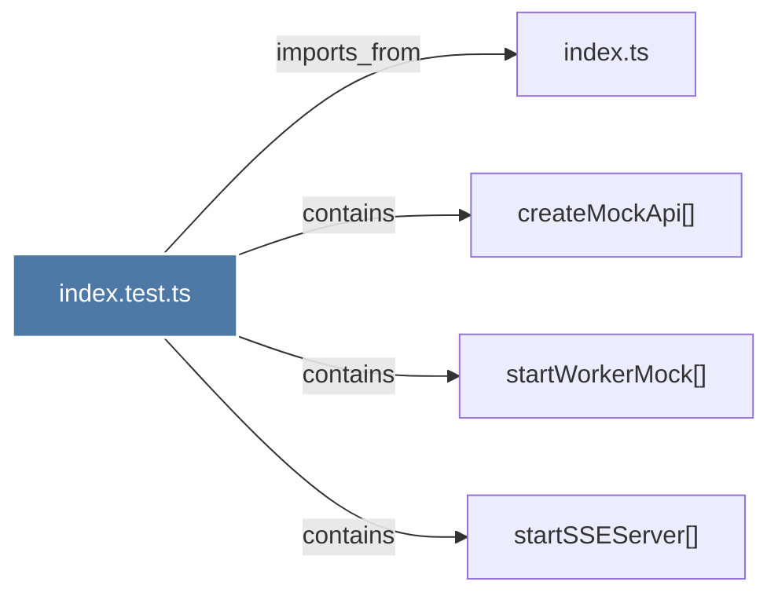

# index.test.ts

> [!info] Properties
> **File Type**: code
> **Community**: [[_COMMUNITY_Community None|Community None]]
> **Degree**: 4

## Architecture Graph


## Outbound Connections
- [[createMockApi()]] - `contains` [EXTRACTED]
- [[index.ts]] - `imports_from` [EXTRACTED]
- [[startSSEServer()]] - `contains` [EXTRACTED]
- [[startWorkerMock()]] - `contains` [EXTRACTED]

## Inbound Dependencies
> [!abstract]- Files that link here
```dataview
LIST
FROM [[index.test.ts_1]]
```

#graphify/code #graphify/EXTRACTED #community/Community_None