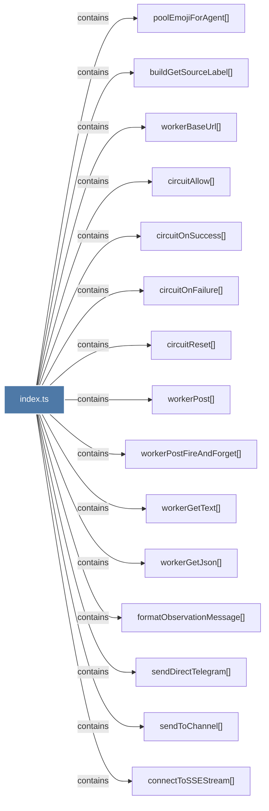

# index.ts

> [!info] Properties
> **File Type**: code
> **Community**: [[_COMMUNITY_Community None|Community None]]
> **Degree**: 17

## Architecture Graph


## Outbound Connections
- [[buildGetSourceLabel()]] - `contains` [EXTRACTED]
- [[circuitAllow()]] - `contains` [EXTRACTED]
- [[circuitOnFailure()]] - `contains` [EXTRACTED]
- [[circuitOnSuccess()]] - `contains` [EXTRACTED]
- [[circuitReset()]] - `contains` [EXTRACTED]
- [[claudeMemPlugin()]] - `contains` [EXTRACTED]
- [[connectToSSEStream()]] - `contains` [EXTRACTED]
- [[formatObservationMessage()]] - `contains` [EXTRACTED]
- [[index.test.ts_1]] - `imports_from` [EXTRACTED]
- [[poolEmojiForAgent()]] - `contains` [EXTRACTED]
- [[sendDirectTelegram()]] - `contains` [EXTRACTED]
- [[sendToChannel()]] - `contains` [EXTRACTED]
- [[workerBaseUrl()]] - `contains` [EXTRACTED]
- [[workerGetJson()]] - `contains` [EXTRACTED]
- [[workerGetText()]] - `contains` [EXTRACTED]
- [[workerPost()]] - `contains` [EXTRACTED]
- [[workerPostFireAndForget()]] - `contains` [EXTRACTED]

## Inbound Dependencies
> [!abstract]- Files that link here
```dataview
LIST
FROM [[index.ts]]
```

#graphify/code #graphify/EXTRACTED #community/Community_None