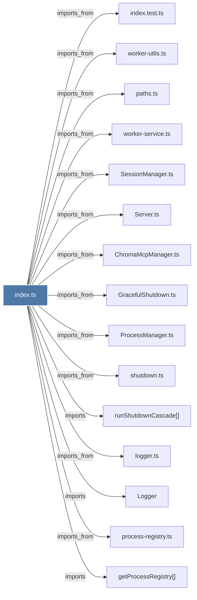

# index.ts

> [!info] Properties
> **File Type**: code
> **Community**: [[_COMMUNITY_Community None|Community None]]
> **Degree**: 25

## Architecture Graph


## Outbound Connections
- [[ChromaMcpManager.ts]] - `imports_from` [EXTRACTED]
- [[GracefulShutdown.ts]] - `imports_from` [EXTRACTED]
- [[Logger]] - `imports` [EXTRACTED]
- [[ProcessManager.ts]] - `imports_from` [EXTRACTED]
- [[ProcessRegistry]] - `imports` [EXTRACTED]
- [[Server.ts]] - `imports_from` [EXTRACTED]
- [[SessionManager.ts]] - `imports_from` [EXTRACTED]
- [[Supervisor]] - `contains` [EXTRACTED]
- [[configureSupervisorSignalHandlers()]] - `contains` [EXTRACTED]
- [[getProcessRegistry()]] - `imports` [EXTRACTED]
- [[getSupervisor()]] - `contains` [EXTRACTED]
- [[health-checker.ts]] - `imports_from` [EXTRACTED]
- [[index.test.ts]] - `imports_from` [EXTRACTED]
- [[logger.ts]] - `imports_from` [EXTRACTED]
- [[paths.ts]] - `imports_from` [EXTRACTED]
- [[process-registry.ts]] - `imports_from` [EXTRACTED]
- [[runShutdownCascade()]] - `imports` [EXTRACTED]
- [[shutdown.ts]] - `imports_from` [EXTRACTED]
- [[startHealthChecker()]] - `imports` [EXTRACTED]
- [[startSupervisor()]] - `contains` [EXTRACTED]
- [[stopHealthChecker()]] - `imports` [EXTRACTED]
- [[validateWorkerPidFile()]] - `contains` [EXTRACTED]
- [[verifyPidFileOwnership()]] - `imports` [EXTRACTED]
- [[worker-service.ts]] - `imports_from` [EXTRACTED]
- [[worker-utils.ts]] - `imports_from` [EXTRACTED]

## Inbound Dependencies
> [!abstract]- Files that link here
```dataview
LIST
FROM [[index.ts_11]]
```

#graphify/code #graphify/EXTRACTED #community/Community_None