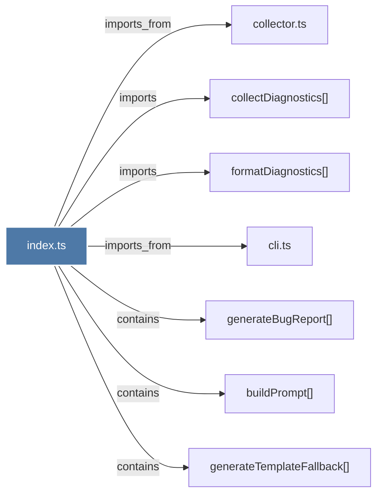

# index.ts

> [!info] Properties
> **File Type**: code
> **Community**: [[_COMMUNITY_Community None|Community None]]
> **Degree**: 7

## Architecture Graph


## Outbound Connections
- [[buildPrompt()]] - `contains` [EXTRACTED]
- [[cli.ts_1]] - `imports_from` [EXTRACTED]
- [[collectDiagnostics()]] - `imports` [EXTRACTED]
- [[collector.ts]] - `imports_from` [EXTRACTED]
- [[formatDiagnostics()]] - `imports` [EXTRACTED]
- [[generateBugReport()]] - `contains` [EXTRACTED]
- [[generateTemplateFallback()]] - `contains` [EXTRACTED]

## Inbound Dependencies
> [!abstract]- Files that link here
```dataview
LIST
FROM [[index.ts_13]]
```

#graphify/code #graphify/EXTRACTED #community/Community_None