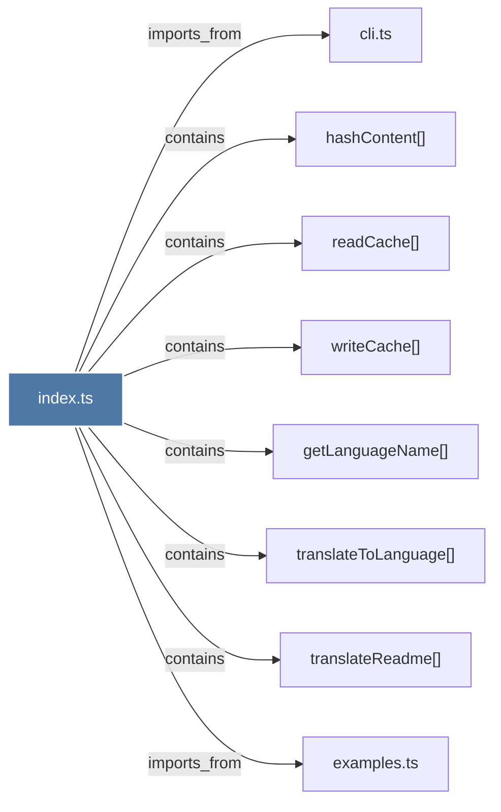

# index.ts

> [!info] Properties
> **File Type**: code
> **Community**: [[_COMMUNITY_Community None|Community None]]
> **Degree**: 8

## Architecture Graph


## Outbound Connections
- [[cli.ts_2]] - `imports_from` [EXTRACTED]
- [[examples.ts]] - `imports_from` [EXTRACTED]
- [[getLanguageName()]] - `contains` [EXTRACTED]
- [[hashContent()]] - `contains` [EXTRACTED]
- [[readCache()]] - `contains` [EXTRACTED]
- [[translateReadme()]] - `contains` [EXTRACTED]
- [[translateToLanguage()]] - `contains` [EXTRACTED]
- [[writeCache()]] - `contains` [EXTRACTED]

## Inbound Dependencies
> [!abstract]- Files that link here
```dataview
LIST
FROM [[index.ts_14]]
```

#graphify/code #graphify/EXTRACTED #community/Community_None