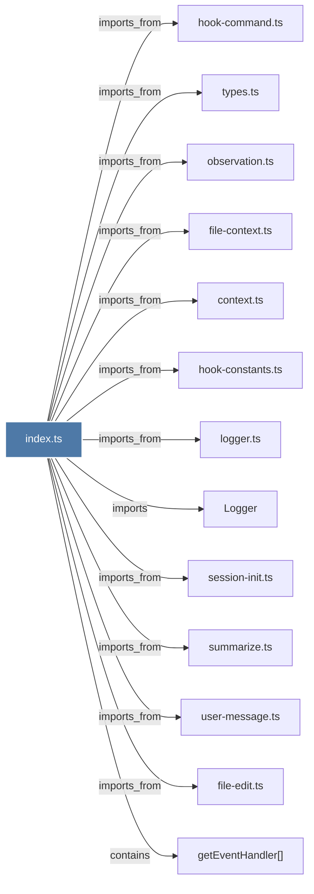

# index.ts

> [!info] Properties
> **File Type**: code
> **Community**: [[_COMMUNITY_Community None|Community None]]
> **Degree**: 13

## Architecture Graph


## Outbound Connections
- [[Logger]] - `imports` [EXTRACTED]
- [[context.ts]] - `imports_from` [EXTRACTED]
- [[file-context.ts]] - `imports_from` [EXTRACTED]
- [[file-edit.ts]] - `imports_from` [EXTRACTED]
- [[getEventHandler()]] - `contains` [EXTRACTED]
- [[hook-command.ts]] - `imports_from` [EXTRACTED]
- [[hook-constants.ts]] - `imports_from` [EXTRACTED]
- [[logger.ts]] - `imports_from` [EXTRACTED]
- [[observation.ts]] - `imports_from` [EXTRACTED]
- [[session-init.ts]] - `imports_from` [EXTRACTED]
- [[summarize.ts]] - `imports_from` [EXTRACTED]
- [[types.ts]] - `imports_from` [EXTRACTED]
- [[user-message.ts]] - `imports_from` [EXTRACTED]

## Inbound Dependencies
> [!abstract]- Files that link here
```dataview
LIST
FROM [[index.ts_2]]
```

#graphify/code #graphify/EXTRACTED #community/Community_None