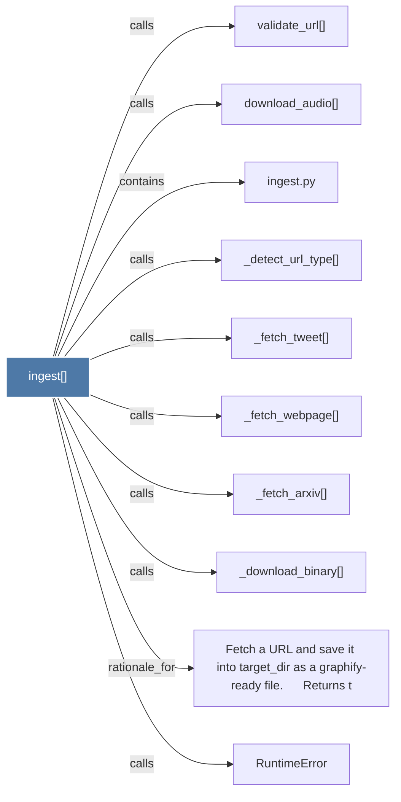

# ingest()

> [!info] Properties
> **File Type**: code
> **Community**: [[_COMMUNITY_Community None|Community None]]
> **Degree**: 10

## Architecture Graph


## Outbound Connections
- [[Fetch a URL and save it into target_dir as a graphify-ready file.      Returns t]] - `rationale_for` [EXTRACTED]
- [[RuntimeError]] - `calls` [INFERRED]
- [[_detect_url_type()]] - `calls` [EXTRACTED]
- [[_download_binary()]] - `calls` [EXTRACTED]
- [[_fetch_arxiv()]] - `calls` [EXTRACTED]
- [[_fetch_tweet()]] - `calls` [EXTRACTED]
- [[_fetch_webpage()]] - `calls` [EXTRACTED]
- [[download_audio()]] - `calls` [INFERRED]
- [[ingest.py]] - `contains` [EXTRACTED]
- [[validate_url()]] - `calls` [INFERRED]

## Inbound Dependencies
> [!abstract]- Files that link here
```dataview
LIST
FROM [[ingest()]]
```

#graphify/code #graphify/EXTRACTED #community/Community_None