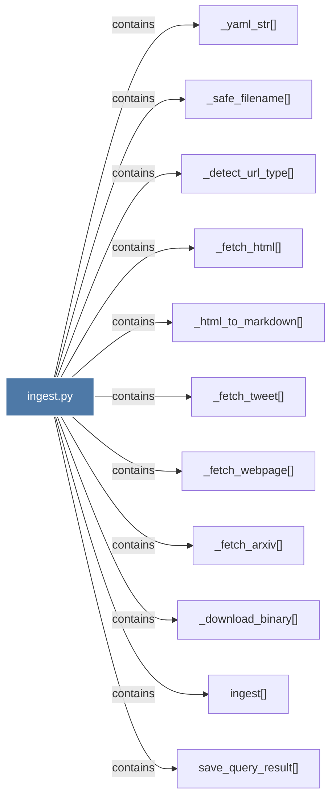

# ingest.py

> [!info] Properties
> **File Type**: code
> **Community**: [[_COMMUNITY_Community None|Community None]]
> **Degree**: 11

## Architecture Graph


## Outbound Connections
- [[_detect_url_type()]] - `contains` [EXTRACTED]
- [[_download_binary()]] - `contains` [EXTRACTED]
- [[_fetch_arxiv()]] - `contains` [EXTRACTED]
- [[_fetch_html()]] - `contains` [EXTRACTED]
- [[_fetch_tweet()]] - `contains` [EXTRACTED]
- [[_fetch_webpage()]] - `contains` [EXTRACTED]
- [[_html_to_markdown()]] - `contains` [EXTRACTED]
- [[_safe_filename()_1]] - `contains` [EXTRACTED]
- [[_yaml_str()]] - `contains` [EXTRACTED]
- [[ingest()]] - `contains` [EXTRACTED]
- [[save_query_result()]] - `contains` [EXTRACTED]

## Inbound Dependencies
> [!abstract]- Files that link here
```dataview
LIST
FROM [[ingest.py]]
```

#graphify/code #graphify/EXTRACTED #community/Community_None