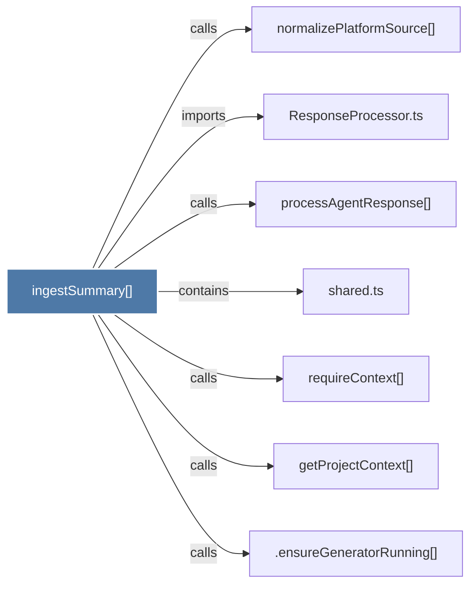

# ingestSummary()

> [!info] Properties
> **File Type**: code
> **Community**: [[_COMMUNITY_Community None|Community None]]
> **Degree**: 7

## Architecture Graph


## Outbound Connections
- [[.ensureGeneratorRunning()]] - `calls` [INFERRED]
- [[ResponseProcessor.ts]] - `imports` [EXTRACTED]
- [[getProjectContext()]] - `calls` [INFERRED]
- [[normalizePlatformSource()]] - `calls` [INFERRED]
- [[processAgentResponse()]] - `calls` [INFERRED]
- [[requireContext()]] - `calls` [EXTRACTED]
- [[shared.ts]] - `contains` [EXTRACTED]

## Inbound Dependencies
> [!abstract]- Files that link here
```dataview
LIST
FROM [[ingestSummary()]]
```

#graphify/code #graphify/INFERRED #community/Community_None