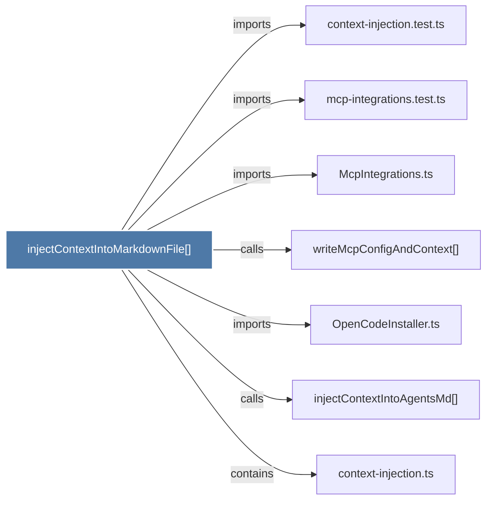

# injectContextIntoMarkdownFile()

> [!info] Properties
> **File Type**: code
> **Community**: [[_COMMUNITY_Community None|Community None]]
> **Degree**: 7

## Architecture Graph


## Outbound Connections
- [[McpIntegrations.ts]] - `imports` [EXTRACTED]
- [[OpenCodeInstaller.ts]] - `imports` [EXTRACTED]
- [[context-injection.test.ts]] - `imports` [EXTRACTED]
- [[context-injection.ts]] - `contains` [EXTRACTED]
- [[injectContextIntoAgentsMd()]] - `calls` [INFERRED]
- [[mcp-integrations.test.ts]] - `imports` [EXTRACTED]
- [[writeMcpConfigAndContext()]] - `calls` [INFERRED]

## Inbound Dependencies
> [!abstract]- Files that link here
```dataview
LIST
FROM [[injectContextIntoMarkdownFile()]]
```

#graphify/code #graphify/EXTRACTED #community/Community_None