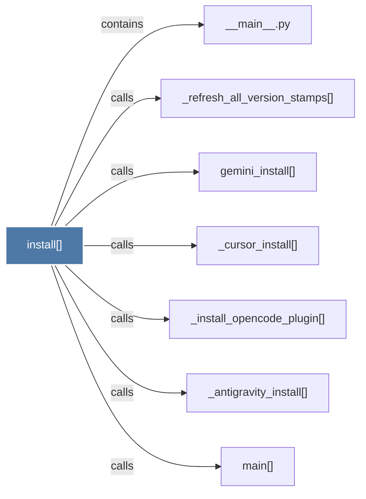

# install()

> [!info] Properties
> **File Type**: code
> **Community**: [[_COMMUNITY_Community None|Community None]]
> **Degree**: 7

## Architecture Graph


## Outbound Connections
- [[__main__.py]] - `contains` [EXTRACTED]
- [[_antigravity_install()]] - `calls` [EXTRACTED]
- [[_cursor_install()]] - `calls` [EXTRACTED]
- [[_install_opencode_plugin()]] - `calls` [EXTRACTED]
- [[_refresh_all_version_stamps()]] - `calls` [EXTRACTED]
- [[gemini_install()]] - `calls` [EXTRACTED]
- [[main()_2]] - `calls` [EXTRACTED]

## Inbound Dependencies
> [!abstract]- Files that link here
```dataview
LIST
FROM [[install()_1]]
```

#graphify/code #graphify/EXTRACTED #community/Community_None