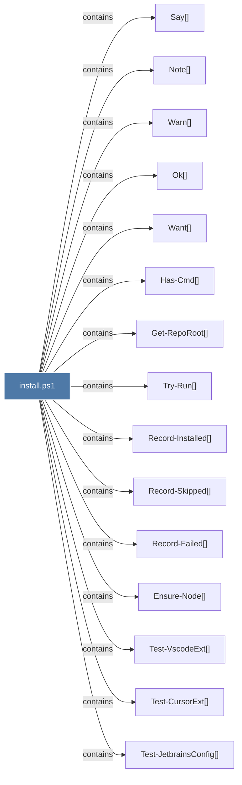

# install.ps1

> [!info] Properties
> **File Type**: code
> **Community**: [[_COMMUNITY_Community None|Community None]]
> **Degree**: 21

## Architecture Graph


## Outbound Connections
- [[Ensure-Node()]] - `contains` [EXTRACTED]
- [[Get-RepoRoot()]] - `contains` [EXTRACTED]
- [[Has-Cmd()]] - `contains` [EXTRACTED]
- [[Install-Claude()]] - `contains` [EXTRACTED]
- [[Install-Gemini()]] - `contains` [EXTRACTED]
- [[Install-ViaSkills()]] - `contains` [EXTRACTED]
- [[Note()]] - `contains` [EXTRACTED]
- [[Ok()]] - `contains` [EXTRACTED]
- [[Record-Failed()]] - `contains` [EXTRACTED]
- [[Record-Installed()]] - `contains` [EXTRACTED]
- [[Record-Skipped()]] - `contains` [EXTRACTED]
- [[Resolve-DetectSpec()]] - `contains` [EXTRACTED]
- [[Run-Init()]] - `contains` [EXTRACTED]
- [[Say()]] - `contains` [EXTRACTED]
- [[Test-CursorExt()]] - `contains` [EXTRACTED]
- [[Test-JetbrainsConfig()]] - `contains` [EXTRACTED]
- [[Test-JetbrainsPlugin()]] - `contains` [EXTRACTED]
- [[Test-VscodeExt()]] - `contains` [EXTRACTED]
- [[Try-Run()]] - `contains` [EXTRACTED]
- [[Want()]] - `contains` [EXTRACTED]
- [[Warn()]] - `contains` [EXTRACTED]

## Inbound Dependencies
> [!abstract]- Files that link here
```dataview
LIST
FROM [[install.ps1]]
```

#graphify/code #graphify/EXTRACTED #community/Community_None