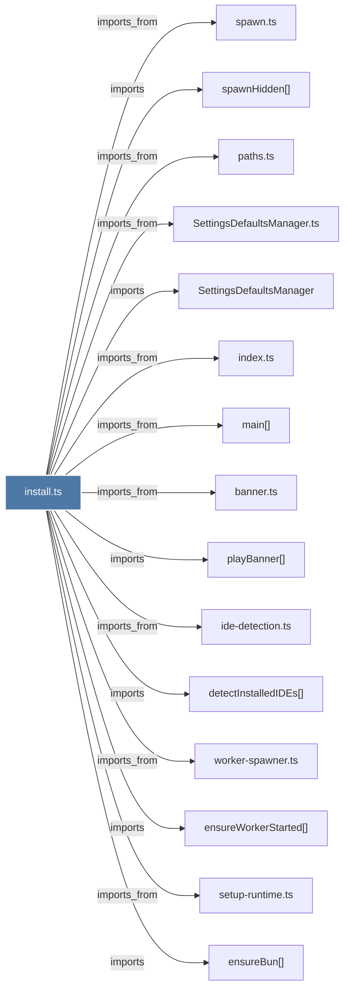

# install.ts

> [!info] Properties
> **File Type**: code
> **Community**: [[_COMMUNITY_Community None|Community None]]
> **Degree**: 55

## Architecture Graph


## Outbound Connections
- [[SettingsDefaultsManager]] - `imports` [EXTRACTED]
- [[SettingsDefaultsManager.ts]] - `imports_from` [EXTRACTED]
- [[applyClaudeCodePathSetupIfNeeded()]] - `contains` [EXTRACTED]
- [[banner.ts]] - `imports_from` [EXTRACTED]
- [[bufferConsole()]] - `contains` [EXTRACTED]
- [[claudeSettingsPath()]] - `imports` [EXTRACTED]
- [[copyPluginToCache()]] - `contains` [EXTRACTED]
- [[copyPluginToMarketplace()]] - `contains` [EXTRACTED]
- [[detectInstalledIDEs()]] - `imports` [EXTRACTED]
- [[detectShellConfigFile()]] - `contains` [EXTRACTED]
- [[enablePluginInClaudeSettings()]] - `contains` [EXTRACTED]
- [[ensureBun()]] - `imports` [EXTRACTED]
- [[ensureDirectoryExists()]] - `imports` [EXTRACTED]
- [[ensureUv()]] - `imports` [EXTRACTED]
- [[ensureWorkerStarted()]] - `imports` [EXTRACTED]
- [[getSetting()]] - `contains` [EXTRACTED]
- [[ide-detection.ts]] - `imports_from` [EXTRACTED]
- [[index.ts_3]] - `imports_from` [EXTRACTED]
- [[installClaudeCode()]] - `contains` [EXTRACTED]
- [[installPluginDependencies()]] - `imports` [EXTRACTED]
- [[installedPluginsPath()]] - `imports` [EXTRACTED]
- [[isInstallCurrent()]] - `imports` [EXTRACTED]
- [[json-utils.ts]] - `imports_from` [EXTRACTED]
- [[knownMarketplacesPath()]] - `imports` [EXTRACTED]
- [[main()_21]] - `imports_from` [EXTRACTED]
- [[makeIDETask()]] - `contains` [EXTRACTED]
- [[marketplaceDirectory()]] - `imports` [EXTRACTED]
- [[mergeSettings()]] - `contains` [EXTRACTED]
- [[npmPackagePluginDirectory()]] - `imports` [EXTRACTED]
- [[npmPackageRootDirectory()]] - `imports` [EXTRACTED]
- [[paths.ts]] - `imports_from` [EXTRACTED]
- [[paths.ts_1]] - `imports_from` [EXTRACTED]
- [[playBanner()]] - `imports` [EXTRACTED]
- [[pluginCacheDirectory()]] - `imports` [EXTRACTED]
- [[pluginsDirectory()]] - `imports` [EXTRACTED]
- [[promptClaudeModel()]] - `contains` [EXTRACTED]
- [[promptForIDESelection()]] - `contains` [EXTRACTED]
- [[promptProvider()]] - `contains` [EXTRACTED]
- [[readJsonSafe()]] - `imports` [EXTRACTED]
- [[readPluginVersion()]] - `imports` [EXTRACTED]
- [[registerMarketplace()]] - `contains` [EXTRACTED]
- [[registerPlugin()]] - `contains` [EXTRACTED]
- [[runInstallCommand()]] - `contains` [EXTRACTED]
- [[runNpmInstallInMarketplace()]] - `contains` [EXTRACTED]
- [[runRepairCommand()]] - `contains` [EXTRACTED]
- [[runTasks()]] - `contains` [EXTRACTED]
- [[setup-runtime.ts]] - `imports_from` [EXTRACTED]
- [[setupIDEs()]] - `contains` [EXTRACTED]
- [[shutdown-helper.ts]] - `imports_from` [EXTRACTED]
- [[shutdownWorkerAndWait()]] - `imports` [EXTRACTED]
- [[spawn.ts]] - `imports_from` [EXTRACTED]
- [[spawnHidden()]] - `imports` [EXTRACTED]
- [[worker-spawner.ts]] - `imports_from` [EXTRACTED]
- [[writeInstallMarker()]] - `imports` [EXTRACTED]
- [[writeJsonFileAtomic()]] - `imports` [EXTRACTED]

## Inbound Dependencies
> [!abstract]- Files that link here
```dataview
LIST
FROM [[install.ts]]
```

#graphify/code #graphify/EXTRACTED #community/Community_None