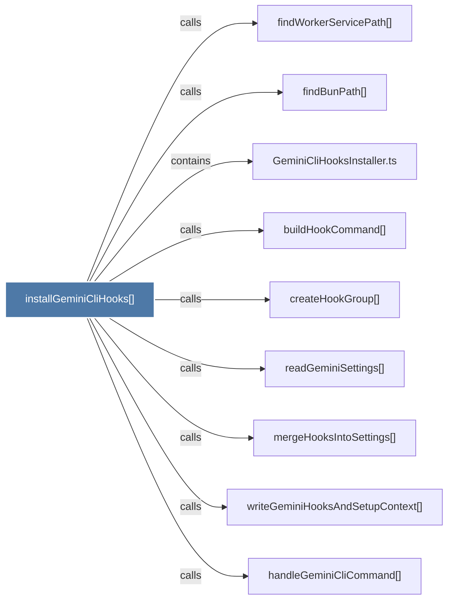

# installGeminiCliHooks()

> [!info] Properties
> **File Type**: code
> **Community**: [[_COMMUNITY_Community None|Community None]]
> **Degree**: 9

## Architecture Graph


## Outbound Connections
- [[GeminiCliHooksInstaller.ts]] - `contains` [EXTRACTED]
- [[buildHookCommand()_1]] - `calls` [EXTRACTED]
- [[createHookGroup()]] - `calls` [EXTRACTED]
- [[findBunPath()]] - `calls` [INFERRED]
- [[findWorkerServicePath()]] - `calls` [INFERRED]
- [[handleGeminiCliCommand()]] - `calls` [EXTRACTED]
- [[mergeHooksIntoSettings()]] - `calls` [EXTRACTED]
- [[readGeminiSettings()]] - `calls` [EXTRACTED]
- [[writeGeminiHooksAndSetupContext()]] - `calls` [EXTRACTED]

## Inbound Dependencies
> [!abstract]- Files that link here
```dataview
LIST
FROM [[installGeminiCliHooks()]]
```

#graphify/code #graphify/EXTRACTED #community/Community_None